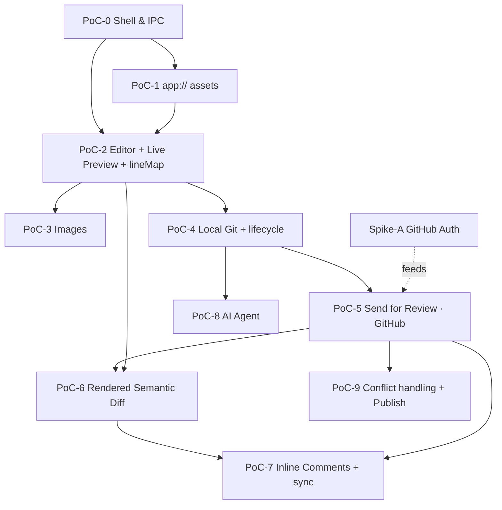

# SpecDesk — PoC-Driven Roadmap

> Working document. We build SpecDesk as a chain of **proof-of-concept (PoC) milestones**.
> Each PoC is a thin **vertical slice** that retires one concrete technical risk and ends in
> a **demoable** state. The design behind each slice lives in [`docs/design/`](design/README.md);
> this file is the execution plan we work by.

## How to read this roadmap

Each PoC below answers four questions:

- **Goal** — the one sentence that defines "done".
- **Retires risk** — the unknown this slice exists to prove. If the risk is already obvious, the PoC is too big.
- **Demo / acceptance** — the observable behaviour that closes the milestone. No demo, no done.
- **Effort** — rough size: **S** (days), **M** (1–2 weeks), **L** (2–4 weeks), solo-dev scale.

Rules we hold ourselves to:

1. **Every PoC ships something runnable.** Even PoC‑0 launches a window. We never have a milestone that only "lays groundwork".
2. **No git vocabulary leaks to the author** — even in throwaway PoC UI, we use Draft / Saved / In review (see [design/04-git-workflow.md](design/04-git-workflow.md)).
3. **Native is the brain, webview is thin.** Every PoC keeps Markdown/git/GitHub/AI logic in C#/F#; TypeScript stays minimal (see [design/02-architecture.md](design/02-architecture.md)).
4. **`lineMap` is sacred.** Built in PoC‑2, reused by PoCs 6 and 7. Getting it right early is cheaper than retrofitting.

## Dependency graph

The critical path is **P0 → P2 → P4 → P5 → P6 → P7**. Images (P3) and the AI agent (P8) hang
off the side and can slot in whenever convenient — they don't block review. **Spike‑A (auth)**
is the first real integration risk and runs **in parallel from day one**, independent of the UI.

---

## Spike‑A — GitHub auth (parallel, start immediately)

- **Goal:** prove we can authenticate to GitHub and perform one real write (open a throwaway PR via Octokit) from a console harness.
- **Retires risk:** the auth model is the single biggest external unknown — GitHub App vs OAuth device flow vs PAT, token storage, scopes. The roadmap's own note says *spike it early even if the UI lags* ([design/03-roadmap.md](design/03-roadmap.md)).
- **Build:** a `SpecDesk.GitHub` console spike that authenticates (try **device flow** first for simplicity, evaluate **GitHub App** for org rollout), pushes a branch, opens and closes a PR on a test repo. Decide and **document the chosen auth model** in [design/04-git-workflow.md](design/04-git-workflow.md) "Decisions to lock".
- **Demo / acceptance:** running the console app opens a real PR on a sandbox repo and prints its URL; the auth decision is written down.
- **Effort:** **M** · **Depends on:** nothing.

> Output of this spike is consumed by PoC‑5. Keep it as a throwaway harness, not production code.

---

## PoC‑0 — Shell & IPC contract

> **Foundation done.** The multi-language repo skeleton is scaffolded and builds green: the
> `SpecDesk.slnx` solution with all 8 src + 3 test projects (C#/F#), the `webview/` TypeScript
> bundle (esbuild), CI, and a minimal Photino `Program.cs`. What remains for PoC‑0 is the real
> IPC router + typed envelope + echo round-trip.

- **Goal:** an empty Photino window that proves the native↔webview message contract end to end.
- **Retires risk:** does Photino + system WebView2 + our esbuild pipeline + the typed JSON envelope actually round-trip cleanly? This is the foundation every later PoC sits on.
- **Build:**
  - Photino window hosting WebView2; `esbuild` bundling the `webview/` TypeScript.
  - IPC router with the typed envelope (`kind` / `id` / `version` / `payload`) from [design/09-ipc-protocol.md](design/09-ipc-protocol.md); DTOs in `SpecDesk.Contracts`.
  - A round-trip **echo** message (webview → native → webview) with `id` correlation.
- **Out of scope:** any Markdown, git, or real UI.
- **Demo / acceptance:** click a button in the webview, native echoes a payload back with the matching `id`, webview displays it. Solution layout from [design/02-architecture.md](design/02-architecture.md) is scaffolded.
- **Effort:** **M** · **Depends on:** nothing.

## PoC‑1 — `app://` local asset serving

- **Goal:** the webview loads a local image from the active working folder via the custom `app://` scheme.
- **Retires risk:** Photino has no `SetVirtualHostNameToFolderMapping`; we must hand-roll a scheme handler. This is the make-or-break for showing local images in preview and is cheap to prove in isolation.
- **Build:** register the `app://` scheme in the Photino host; handler serves files from a chosen working directory with path-escape protection (never serve outside the tree).
- **Demo / acceptance:** an `` injected into the webview renders a file from disk; a `../` traversal attempt is rejected.
- **Effort:** **S** · **Depends on:** PoC‑0.

## PoC‑2 — Editor + live preview + `lineMap` ⭐

- **Goal:** a working local Markdown editor with rendered preview and bidirectional scroll-sync — no git.
- **Retires risk:** the heart of the product. Proves (a) Markdig precise source spans → a usable `lineMap`, (b) native-only Markdown rendering injected into a thin webview, (c) the debounce/`version`/cancellation discipline that keeps a fast typist's preview correct.
- **Build:**
  - CodeMirror 6 source editor in the webview.
  - `SpecDesk.Markdown`: Markdig parse (`UsePreciseSourceLocation`) → HTML + `lineMap`, plus the F# AST projection DU ([design/05-live-preview.md](design/05-live-preview.md)).
  - `preview.html {html, lineMap, version}` injection; stale-version results dropped; in-flight parse cancelled on newer edit.
  - Scroll-sync driven by `data-line-start/end`, with a scroll-lock to prevent feedback loops.
  - Plain filesystem open/save (no git).
- **Out of scope:** images, git, comments, diff.
- **Demo / acceptance:** open a `.md`, type, see live preview within ~120 ms; scroll either pane and the other tracks; rapid typing never shows a stale render; the F# AST DU is unit-tested in `SpecDesk.Markdown.Tests`.
- **Effort:** **L** · **Depends on:** PoC‑0 (PoC‑1 nice-to-have for inline images).

> ⭐ This is the most important PoC. The `lineMap` and the single shared Markdig configuration
> built here are reused by the diff (PoC‑6) and comments (PoC‑7). Do not rush it.

## PoC‑3 — Image drop / paste → rule engine

- **Goal:** drag or paste an image; it lands in the correct repo folder with a compliant name and a relative link appears at the cursor.
- **Retires risk:** the clipboard/drop capture path in the webview, and the F# token-expansion rule engine. Highest-value self-contained feature; deliberately decoupled from git so it can ship to early dogfooders before any network.
- **Build:**
  - Webview capture of drop + clipboard paste → `image.paste {base64, originalName?, mime}`.
  - `SpecDesk.Core` image-rule engine ([design/06-images.md](design/06-images.md)): format sniff, optional re-encode/strip-metadata/downscale (ImageSharp), folder + naming token expansion, constraint enforcement, `{hash8}` de-duplication, relative-link computation.
  - Reads `[images]` from `.spectool.toml` ([design/10-repo-config.md](design/10-repo-config.md)).
- **Demo / acceptance:** paste a screenshot → file written to `images/{docSlug}/…-{hash8}.png`, link inserted, preview resolves it via `app://`; pasting the same image twice reuses one file.
- **Effort:** **M** · **Depends on:** PoC‑1, PoC‑2.

## PoC‑4 — Local git layer + document lifecycle

- **Goal:** edits are versioned in git, entirely local, with **zero git vocabulary** on screen.
- **Retires risk:** LibGit2Sharp integration and the F# lifecycle state machine (the spine of the whole workflow), proven without any GitHub dependency.
- **Build:**
  - Repo registration; background auto-fetch (`Sync`).
  - F# document lifecycle state machine: **Edit** → silent working branch from latest → autosave **commits** on idle ([design/04-git-workflow.md](design/04-git-workflow.md)).
  - Deterministic commit-message template (agent comes later).
  - Status surface: **Draft / Saving… / Saved** via the `status` message.
- **Out of scope:** push, PR, GitHub of any kind.
- **Demo / acceptance:** click **Edit** → a branch is created under the hood (verifiable with raw git, invisible in UI); typing produces autosave commits; status cycles Saving→Saved; `git log` shows sensible commits. State machine unit-tested in `SpecDesk.Core.Tests`.
- **Effort:** **L** · **Depends on:** PoC‑2.

## PoC‑5 — Send for review (GitHub round-trip)

- **Goal:** one button takes a local Draft to an open PR on GitHub; status reflects review state.
- **Retires risk:** wiring Spike‑A's auth into the app and the full author round-trip; the first time real GitHub state drives the UI.
- **Build:**
  - Fold the Spike‑A auth decision into `SpecDesk.GitHub` (Octokit) as production code.
  - **Send for review**: push branch + open PR with a generated, editable title/description (deterministic template).
  - Reviewer assignment (`.spectool.toml` `reviewers` / CODEOWNERS).
  - PR list (author/reviewer/by-URL); status: **In review / Changes requested / Approved**; autosave-while-in-review pushes an **Update**.
- **Demo / acceptance:** edit a spec, click **Send for review**, a real PR opens with sensible title/body and reviewers; editing afterward pushes more commits and the status updates from GitHub.
- **Effort:** **L** · **Depends on:** PoC‑4, Spike‑A.

## PoC‑6 — Rendered semantic diff

- **Goal:** review a change as a **structural, rendered** diff — not raw `.md` lines — with a raw toggle.
- **Retires risk:** the F# AST tree-diff (match/added/removed/changed/moved) and rendering it the same way the preview renders. This is the experience GitHub cannot provide ([design/07-review-experience.md](design/07-review-experience.md) Part B).
- **Build:**
  - Fetch base + head versions of changed `.md` files.
  - `SpecDesk.Diff`: AST diff over the shared DU → annotated tree → HTML (side-by-side + unified).
  - Mandatory **toggle**: rendered ↔ raw source diff.
- **Demo / acceptance:** a PR that changes a heading level and moves a paragraph renders as *one* structural edit + a "moved here", not as line-noise; toggling shows the literal source diff. Diff cases unit-tested in `SpecDesk.Diff.Tests`.
- **Effort:** **L** · **Depends on:** PoC‑5 (for PR content), PoC‑2 (shared AST/render).

## PoC‑7 — Inline comments + GitHub sync

- **Goal:** comment on the rendered document inside the app; comments synchronize with the PR.
- **Retires risk:** anchoring comments through `lineMap` to GitHub's `(path, commit_id, line, side)` diff-position model, including the "comment outside the diff hunk" edge case.
- **Build:**
  - Local comment model (source of truth) anchored via `lineMap` ([design/07-review-experience.md](design/07-review-experience.md) Part A).
  - GitHub sync: pull existing PR review comments → map to rendered nodes; post new ones when inside a diff hunk; keep out-of-hunk ones local and clearly labelled; replies + resolve mirrored when synced.
  - Re-anchor on head-commit change.
- **Demo / acceptance:** leave a comment in-app → it appears on the GitHub PR; a comment left on GitHub appears inline in-app; a comment on an unchanged line stays local with the "not yet on GitHub" label instead of failing.
- **Effort:** **L** · **Depends on:** PoC‑6, PoC‑5.

## PoC‑8 — AI agent (parallel, slots in any time after PoC‑4)

- **Goal:** an in-app assistant that drafts commit/PR text and answers questions about the document — every mutating action gated.
- **Retires risk:** Microsoft Agent Framework integration, streaming chat over IPC, and the **confirmation-gate** safety model.
- **Build:**
  - `SpecDesk.Ai` on Microsoft Agent Framework (Claude connector) with non-mutating tools (`getCurrentDoc`, `getDiff`, `searchSpec`, `suggest*`) and gated `proposeEdit` ([design/08-ai-agent.md](design/08-ai-agent.md)).
  - Swap deterministic commit/PR templates for `suggestCommitMessage` / `suggestPrDescription`, keeping templates as fallback.
  - Streaming chat panel (`chat.delta` / `chat.done`).
  - Enforce: every mutating action routes through `confirm.request` ([design/09-ipc-protocol.md](design/09-ipc-protocol.md)); document/tool output treated as data, not instructions.
- **Demo / acceptance:** ask the agent to draft a PR description → it streams a proposal → the author edits and confirms → only then is it applied; with no provider configured, the deterministic template still works.
- **Effort:** **L** · **Depends on:** PoC‑4 (to have something to draft for); richer with PoC‑6.

## PoC‑9 — Conflict handling, publish & polish

- **Goal:** the production-ready manager workflow, including the gentle conflict path and Publish.
- **Retires risk:** the genuinely dangerous part — never showing `<<<<<<<` markers to an author — plus the merge/publish gate.
- **Build:**
  - Rebase-on-send/update; on conflict, the **"Someone else changed this too"** reconciliation dialog (Keep mine / Keep theirs / Combine / Ask for help) — no git markers ever ([design/04-git-workflow.md](design/04-git-workflow.md)).
  - Soft-lock warning when another open PR touches the same file.
  - **Publish** (merge) gated by `allow-author-publish`; auto-delete branch after.
  - New-spec creation; rename/delete as reviewable changes with link fix-ups.
- **Demo / acceptance:** force a conflicting concurrent edit → the author resolves it through the plain-language dialog without ever seeing a conflict marker; an approved PR publishes via the button when permitted.
- **Effort:** **L** · **Depends on:** PoC‑5 (all earlier PoCs in practice).

---

## Sequencing summary

| Order | PoC | Ships | Effort | Gate |
|------:|-----|-------|:------:|------|
| 0 | Shell & IPC | runnable shell, proven contract | M | echo round-trip |
| — | **Spike‑A auth** *(parallel)* | auth decision + real PR from console | M | PR opened from console |
| 1 | `app://` assets | local files in webview | S | image renders, traversal blocked |
| 2 | **Editor + preview + lineMap** ⭐ | useful local MD editor | L | live preview + scroll-sync, no stale renders |
| 3 | Images | auto image insertion | M | paste → correct folder/name/link |
| 4 | Local git + lifecycle | versioned edits, no git words | L | Edit→autosave commits, status cycles |
| 5 | Send for review | full author round-trip to PR | L | real PR opens & updates |
| 6 | Rendered semantic diff | structural review GitHub can't do | L | heading-level/move read as structure |
| 7 | Inline comments | in-app commenting synced to PR | L | round-trip both directions |
| 8 | AI agent *(parallel)* | gated assistant | L | streamed proposal, confirm-then-apply |
| 9 | Conflict + publish + polish | production manager workflow | L | conflict resolved with no markers |

**First dogfood checkpoint:** after **PoC‑3** (editor + images, fully local, no network) — give it to one or two managers.
**First end-to-end review checkpoint:** after **PoC‑7**.

## Decisions to lock as we go (don't let these drift)

These are called out across the design docs; resolve each in the PoC noted, and record the decision in the relevant `docs/design/` file:

- **Auth model** — GitHub App vs device flow vs PAT → **Spike‑A / PoC‑5** ([design/04-git-workflow.md](design/04-git-workflow.md)).
- **Squash on publish?** → PoC‑9 ([design/10-repo-config.md](design/10-repo-config.md) `commit.squash-on-publish`).
- **Who merges** (`allow-author-publish`) → PoC‑9.
- **Draft PRs first?** (`draft-first`) → PoC‑5.
- **Name `SpecDesk`** is a placeholder — rename before any registry/namespace work ([design/README.md](design/README.md)).
- **AI provider/model** default → PoC‑8 ([design/08-ai-agent.md](design/08-ai-agent.md)).

## Relationship to the design docs

The phase list in [design/03-roadmap.md](design/03-roadmap.md) is the *conceptual* phasing. This
file re-cuts those phases into **risk-retiring, demoable PoCs**, adds the **parallel auth spike**
and **parallel AI track**, and makes each milestone's acceptance gate explicit. When the two
disagree, **this file wins** for execution order; the design docs win for *what* each piece does.
