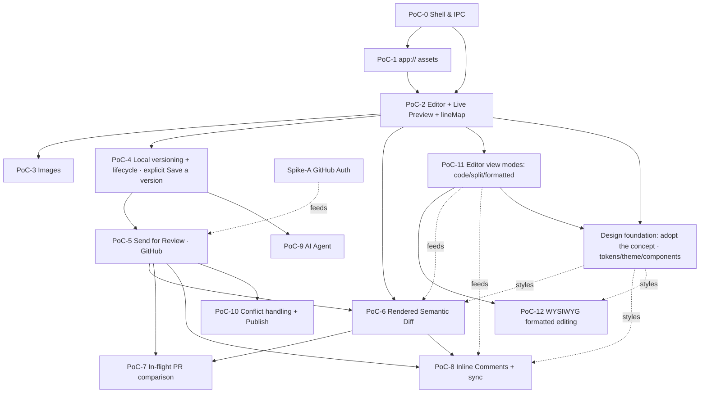

# SpecDesk — PoC-Driven Roadmap

> Working document. We build SpecDesk as a chain of **proof-of-concept (PoC) milestones**.
> Each PoC is a thin **vertical slice** that retires one concrete technical risk and ends in
> a **demoable** state. The design behind each slice lives in [`docs/design/`](design/README.md);
> this file is the execution plan we work by.

## How to read this roadmap

Each PoC below answers four questions:

- **Goal** — the one sentence that defines "done".
- **Retires risk** — the unknown this slice exists to prove. If the risk is already obvious, the PoC is too big.
- **Demo / acceptance** — the observable behaviour that closes the milestone. No demo, no done.
- **Effort** — rough size: **S** (days), **M** (1–2 weeks), **L** (2–4 weeks), solo-dev scale.

Rules we hold ourselves to:

1. **Every PoC ships something runnable.** Even PoC‑0 launches a window. We never have a milestone that only "lays groundwork".
2. **No git vocabulary leaks to the author** — even in throwaway PoC UI, we use Editing / Saved / Version saved / In review (see [design/04-git-workflow.md](design/04-git-workflow.md)). The one deliberate exception is the author-written **version note** (the commit message in plain words).
3. **Committing is explicit, not automatic.** Autosave writes the working copy to disk; a commit only happens when the author chooses **Save a version**. No auto-commit-on-idle (see [design/04-git-workflow.md](design/04-git-workflow.md)).
4. **Native is the brain, webview is thin.** Every PoC keeps Markdown/git/GitHub/AI logic in C#/F#; TypeScript stays minimal (see [design/02-architecture.md](design/02-architecture.md)).
5. **`lineMap` is sacred.** Built in PoC‑2, reused by PoCs 6, 7, and 8. Getting it right early is cheaper than retrofitting.
6. **The UI follows the design concept.** Every visual surface conforms to the agreed concept in
   [`docs/design/`](design/) ([`SpecDesk-Design-Concept.md`](design/SpecDesk-Design-Concept.md) is
   authoritative) — its design tokens, one shared rendered-document stylesheet, CodeMirror editor
   theme, and component specs. A PoC may **extend** the concept with the panels/controls it needs, but
   must stay within its intent (reuse tokens and component language; no one-off styles). See
   [AGENTS.md](../AGENTS.md) → "Design system (UI source of truth)".

## Dependency graph

The critical path is **P0 → P2 → P4 → P5 → P6 → P8**. Comparison (P7) and inline comments (P8)
both hang off the diff engine (P6); comparison is the cheaper of the two because it reuses that
engine on different inputs. Images (P3) and the AI agent (P9) hang off the side and can slot in
whenever convenient — they don't block review. The **editor track (P11 → P12)** is foundational —
it depends only on PoC‑2 and parallels the GitHub track; the *formatted-view* side of the diff (P6)
and comments (P8) depends on the view-modes shell (P11), so P11 is best built early (it can precede
or run alongside the GitHub work). **Spike‑A (auth)** is the first real integration risk and runs
**in parallel from day one**, independent of the UI.

---

## Spike‑A — GitHub auth (parallel, start immediately)

> **Reference:** [borrowings catalog](borrowings-from-knowledge.md) §B — Knowledge uses Octokit **OAuth
> Device Flow**; a working device-flow + token-store reference to adopt.

- **Goal:** prove we can authenticate to GitHub and perform one real write (open a throwaway PR via Octokit) from a console harness.
- **Retires risk:** the auth model is the single biggest external unknown — GitHub App vs OAuth device flow vs PAT, token storage, scopes. The roadmap's own note says *spike it early even if the UI lags* ([design/03-roadmap.md](design/03-roadmap.md)).
- **Build:** a `SpecDesk.GitHub` console spike that authenticates (try **device flow** first for simplicity, evaluate **GitHub App** for org rollout), pushes a branch, opens and closes a PR on a test repo. Decide and **document the chosen auth model** in [design/04-git-workflow.md](design/04-git-workflow.md) "Decisions to lock".
- **Demo / acceptance:** running the console app opens a real PR on a sandbox repo and prints its URL; the auth decision is written down.
- **Effort:** **M** · **Depends on:** nothing.

> Output of this spike is consumed by PoC‑5. Keep it as a throwaway harness, not production code.

---

## Design foundation — adopt the design concept *(do this next)*

> **The immediate next step.** Claude Design delivered an agreed UI concept (in
> [`docs/design/`](design/); authoritative file
> [`SpecDesk-Design-Concept.md`](design/SpecDesk-Design-Concept.md)). This milestone brings the
> **existing** webview UI — today's ad-hoc toolbar, panes, inline bars, preview and editor styling —
> in line with that concept and lays the token/theme groundwork every later UI surface builds on. It
> restyles what PoC‑2 and PoC‑11 already shipped; it adds no new feature behaviour.

- **Goal:** the running app looks like the design concept — surfaces are built from its design tokens,
  the rendered document uses the one shared stylesheet (§5), the editor uses the concept's CodeMirror
  theme (§6), and the existing controls (toolbar buttons, the Code/Split/Formatted segmented control,
  the draft-name and version-note inline bars, the status badge) match the §7 component specs. Light
  **and** dark themes both work.
- **Retires risk:** can the current webview DOM adopt the token system and a dark theme cleanly — by
  **restyling, not rewriting structure** — and does the one rendered-document stylesheet genuinely
  cover preview/formatted today without forking? Prove it once, cheaply, before more UI is built on
  divergent ad-hoc styling that would have to be unwound later.
- **Build:**
  - Add the §4 CSS custom properties to a global stylesheet; theme by `data-theme` on `<html>`.
    Replace the current hard-coded values (`#1a1a1a`, `#fafafa`, `#ddd`, `#fff7d6`, `#f3f3f3`, …) with
    tokens — colour, type (UI sans / serif doc headings / mono editor), spacing, radii, elevation, motion.
  - Apply the §5 rendered-document stylesheet to the preview pane (reused wherever the rendered
    surface later appears); apply the §6 editor theme to CodeMirror.
  - Rebuild the existing components from tokens per §7; swap the caret-matched **yellow** block
    highlight for the `--accent-soft` inset wash; keep the height-sync spacer hatch, token-tinted.
  - A minimal light/dark theme toggle that honours the OS preference (warm theme optional).
  - Accessibility pass per §11 (visible focus ring, `aria-*`, AA contrast, no colour-only state).
- **Out of scope:** new feature surfaces (review hub, comments, AI panel, diff chrome, navigator,
  conflict/empty-state dialogs). They are designed in the concept but land with their own PoCs and
  simply reuse these tokens/components when they do.
- **Demo / acceptance:** launch the app — it visually matches the concept's editor screens
  (Code / Split / Formatted) using only tokenised styles; setting `data-theme="dark"` reskins the
  whole UI with no broken contrast; preview and the formatted view share one stylesheet.
- **Effort:** **M** · **Depends on:** PoC‑2 and PoC‑11 (the surfaces it restyles); foundational for
  every later UI surface.

---

## PoC‑0 — Shell & IPC contract

> **Foundation done.** The multi-language repo skeleton is scaffolded and builds green: the
> `SpecDesk.slnx` solution with all 8 src + 3 test projects (C#/F#), the `webview/` TypeScript
> bundle (esbuild), CI, and a minimal Photino `Program.cs`. What remains for PoC‑0 is the real
> IPC router + typed envelope + echo round-trip.

- **Goal:** an empty Photino window that proves the native↔webview message contract end to end.
- **Retires risk:** does Photino + system WebView2 + our esbuild pipeline + the typed JSON envelope actually round-trip cleanly? This is the foundation every later PoC sits on.
- **Build:**
  - Photino window hosting WebView2; `esbuild` bundling the `webview/` TypeScript.
  - IPC router with the typed envelope (`kind` / `id` / `version` / `payload`) from [design/09-ipc-protocol.md](design/09-ipc-protocol.md); DTOs in `SpecDesk.Contracts`.
  - A round-trip **echo** message (webview → native → webview) with `id` correlation.
- **Out of scope:** any Markdown, git, or real UI.
- **Demo / acceptance:** click a button in the webview, native echoes a payload back with the matching `id`, webview displays it. Solution layout from [design/02-architecture.md](design/02-architecture.md) is scaffolded.
- **Effort:** **M** · **Depends on:** nothing.

## PoC‑1 — `app://` local asset serving

- **Goal:** the webview loads a local image from the active working folder via the custom `app://` scheme.
- **Retires risk:** Photino has no `SetVirtualHostNameToFolderMapping`; we must hand-roll a scheme handler. This is the make-or-break for showing local images in preview and is cheap to prove in isolation.
- **Build:** register the `app://` scheme in the Photino host; handler serves files from a chosen working directory with path-escape protection (never serve outside the tree).
- **Demo / acceptance:** an `` injected into the webview renders a file from disk; a `../` traversal attempt is rejected.
- **Effort:** **S** · **Depends on:** PoC‑0.

## PoC‑2 — Editor + live preview + `lineMap` ⭐

- **Goal:** a working local Markdown editor with rendered preview and bidirectional scroll-sync — no git.
- **Retires risk:** the heart of the product. Proves (a) Markdig precise source spans → a usable `lineMap`, (b) native-only Markdown rendering injected into a thin webview, (c) the debounce/`version`/cancellation discipline that keeps a fast typist's preview correct.
- **Build:**
  - CodeMirror 6 source editor in the webview.
  - `SpecDesk.Markdown`: Markdig parse (`UsePreciseSourceLocation`) → HTML + `lineMap`, plus the F# AST projection DU ([design/05-live-preview.md](design/05-live-preview.md)).
  - `preview.html {html, lineMap, version}` injection; stale-version results dropped; in-flight parse cancelled on newer edit.
  - Scroll-sync driven by `data-line-start/end`, with a scroll-lock to prevent feedback loops.
  - Plain filesystem open/save (no git).
- **Out of scope:** images, git, comments, diff.
- **Demo / acceptance:** open a `.md`, type, see live preview within ~120 ms; scroll either pane and the other tracks; rapid typing never shows a stale render; the F# AST DU is unit-tested in `SpecDesk.Markdown.Tests`.
- **Effort:** **L** · **Depends on:** PoC‑0 (PoC‑1 nice-to-have for inline images).

> ⭐ This is the most important PoC. The `lineMap` and the single shared Markdig configuration
> built here are reused by the diff (PoC‑6), the comparison view (PoC‑7), and comments (PoC‑8).
> Do not rush it.

> **Planned upgrade — height-synced scroll (PoC‑2 follow-up).** Today sync is *anchor-based*, so
> the panes drift between anchors when a rendered block is taller than its source (an image,
> heading, or soft-wrapped line is one source line but tall when rendered). The fix used by mature
> Markdown editors is **height equalization via spacers**: per rendered leaf unit (a block, but also
> each table row and each list item — see `webview/src/editors/sync-anchors.ts`), measure both
> heights (we already have the block↔line `lineMap`) and pad the *shorter* side to match — in the
> editor via CodeMirror **block-widget decorations** below the source lines, and in the preview via
> margins where the source is taller. Equal cumulative offsets ⇒ the panes align pixel-for-pixel
> everywhere, not just at anchors. Recompute on each re-render, image load, font load, and window
> resize; throttle for large documents. A dedicated step; not blocking PoC‑3.

## PoC‑3 — Image drop / paste → rule engine

- **Goal:** drag or paste an image; it lands in the correct repo folder with a compliant name and a relative link appears at the cursor.
- **Retires risk:** the clipboard/drop capture path in the webview, and the F# token-expansion rule engine. Highest-value self-contained feature; deliberately decoupled from git so it can ship to early dogfooders before any network.
- **Build:**
  - Webview capture of drop + clipboard paste → `image.paste {base64, originalName?, mime}`.
  - `SpecDesk.Core` image-rule engine ([design/06-images.md](design/06-images.md)): format sniff, optional re-encode/downscale (SkiaSharp, which drops metadata), folder + naming token expansion, constraint enforcement, `{hash8}` de-duplication, relative-link computation.
  - Reads `[images]` from `.spectool.toml` ([design/10-repo-config.md](design/10-repo-config.md)).
- **Demo / acceptance:** paste a screenshot → file written to `images/{docSlug}/…-{hash8}.png`, link inserted, preview resolves it via `app://`; pasting the same image twice reuses one file.
- **Effort:** **M** · **Depends on:** PoC‑1, PoC‑2.

## PoC‑4 — Local versioning + document lifecycle (explicit "Save a version")

> **Partly built — needs rework.** An earlier pass shipped this PoC with **autosave‑commits**
> (every idle produced a commit). We are deliberately replacing that model: autosave writes the
> **working copy** only, and committing becomes an **explicit "Save a version"** action. The
> LibGit2Sharp wrapper, the lifecycle state machine, and the `.spectool.toml` reader from that
> pass are reused; the autosave‑commit timer and its status cycle are removed.

- **Goal:** edits are versioned in git **on the author's explicit "Save a version"**, entirely
  local, with **zero git vocabulary** on screen (the version *note* is plain language, not a
  git term).
- **Retires risk:** LibGit2Sharp integration and the F# lifecycle state machine (the spine of the whole workflow), proven without any GitHub dependency — now with the corrected explicit‑commit lifecycle.
- **Build:**
  - Repo registration; background auto-fetch (`Sync`).
  - F# document lifecycle state machine: **Edit** → silent working branch from latest →
    **autosave to the working copy** (no commit) → **Save a version** = commit
    ([design/04-git-workflow.md](design/04-git-workflow.md)).
  - **Save a version** action: deterministic generated **note** (commit message), editable by the
    author before confirm; commits the document **and** any pasted image assets.
  - Status surface: **Editing / Unsaved changes / Version saved** via the `status` message.
  - After a version is saved, surface (but do **not** auto-trigger) the "Send for review" next
    step — wired for real in PoC‑5.
- **Out of scope:** push, PR, GitHub of any kind.
- **Demo / acceptance:** click **Edit** → a branch is created under the hood (verifiable with raw git, invisible in UI); typing autosaves to disk with **no** new commits and status shows **Unsaved changes**; clicking **Save a version** with an editable note produces exactly one commit; `git log` shows one sensible commit per saved version (not per keystroke‑idle). State machine unit-tested in `SpecDesk.Core.Tests`.
- **Effort:** **L** · **Depends on:** PoC‑2.

## PoC‑5 — Send for review (GitHub round-trip)

> **Reference:** [borrowings catalog](borrowings-from-knowledge.md) §B — Knowledge's publish state machine +
> `presentPublishError` (error→next-action discriminated union) + `classifyOctokitError`.

- **Goal:** one button takes a saved version to an open PR on GitHub; status reflects review state.
- **Retires risk:** wiring Spike‑A's auth into the app and the full author round-trip; the first time real GitHub state drives the UI.
- **Build:**
  - Fold the Spike‑A auth decision into `SpecDesk.GitHub` as production code — a hand-rolled BCL
    `HttpClient` REST/GraphQL client (no third-party GitHub SDK).
  - **Send for review** (offered right after the first **Save a version**, and always available as
    a button): push branch + open PR with a generated, editable title/description assembled from
    the saved version notes (deterministic template).
  - Reviewer assignment (`.spectool.toml` `reviewers` / CODEOWNERS).
  - **Update review**: after saving a further version while in review, offer to push it to the PR
    (explicit, never silent).
  - PR list (author/reviewer/by-URL); status: **In review / Changes requested / Approved**.
- **Release requirement:** the (public, non-secret) OAuth App client id must be compiled into
  `GitHubAuthOptions.DefaultClientId` (or supplied via env `SPECDESK_GITHUB_CLIENT_ID`) before shipping the
  round-trip — otherwise sign-in ships dark: the account affordance hides and there is no error anywhere.
- **Demo / acceptance:** edit a spec, **Save a version**, click **Send for review** → a real PR opens with sensible title/body and reviewers; save another version and **Update review** → the PR gains the new commit and status updates from GitHub.
- **Effort:** **L** · **Depends on:** PoC‑4, Spike‑A.

## PoC‑6 — Rendered semantic diff

- **Goal:** review a change as a **structural, rendered** diff — not raw `.md` lines — with a raw toggle, surfaced in **both** the source and formatted editor views.
- **Retires risk:** the F# AST tree-diff (match/added/removed/changed/moved) and rendering it the same way the preview renders. This is the experience GitHub cannot provide ([design/07-review-experience.md](design/07-review-experience.md) Part B).
- **Build:**
  - Fetch base + head versions of changed `.md` files.
  - `SpecDesk.Diff`: AST diff over the shared DU → annotated tree → HTML (side-by-side + unified).
    Keep the engine's inputs a **generic `(base, head)` text pair** — PoC‑7 reuses it with
    different bases (working copy / `main`), so don't hard-wire it to "a PR's own base/head".
  - Mandatory **toggle**: rendered ↔ raw source diff.
  - Anchor changed nodes via the `lineMap` so the diff renders in **both** representations: source
    (CodeMirror line styling) and the formatted view (editor decorations). The formatted-view side
    depends on the editor-modes shell (PoC‑11); if that hasn't landed, ship the source/raw side
    first and add the formatted overlay once PoC‑11 exists.
- **Demo / acceptance:** a PR that changes a heading level and moves a paragraph renders as *one* structural edit + a "moved here", not as line-noise; toggling shows the literal source diff. Diff cases unit-tested in `SpecDesk.Diff.Tests`.
- **Effort:** **L** · **Depends on:** PoC‑5 (for PR content), PoC‑2 (shared AST/render).

## PoC‑7 — In-flight PR awareness & comparison

- **Goal:** while editing a spec, see the open PRs that touch the same file and compare any of them — rendered or raw — against the local working copy or against `main`.
- **Retires risk:** the "PRs touching this file" query and the base‑selection plumbing; proving the PoC‑6 diff engine is genuinely input‑agnostic. Turns soft‑lock awareness from a one‑line warning into something actionable ([design/07-review-experience.md](design/07-review-experience.md) Part C).
- **Build:**
  - Query open PRs whose changed‑file set includes the current path (Octokit; cache per `Sync`).
  - **Two comparison bases:** *vs my working copy* (current on‑disk content, including unsaved
    changes) and *vs `main`* (the published baseline); each diffs `(chosen base, PR head)` through
    the PoC‑6 engine.
  - **Both representations** via the PoC‑6 toggle: rendered structural diff and raw source diff.
  - Surface this from the edit‑start soft‑lock warning as its entry point.
- **Out of scope:** pulling another PR's changes in, or resolving across PRs (that is conflict handling, PoC‑10); read‑only comparison only.
- **Demo / acceptance:** open a spec that another open PR also edits → that PR is listed; pick it → see its version diffed against the working copy, toggle to `main`, toggle rendered↔raw, all reusing the PoC‑6 engine with no new diff algorithm.
- **Effort:** **M** · **Depends on:** PoC‑6 (diff engine), PoC‑5 (PR list + PR head content).

## PoC‑8 — Inline comments + GitHub sync

- **Goal:** comment on the document inside the app — in **both** the source and formatted editor views — with comments synchronized with the PR.
- **Retires risk:** anchoring comments through `lineMap` to GitHub's `(path, commit_id, line, side)` diff-position model, including the "comment outside the diff hunk" edge case.
- **Build:**
  - Local comment model (source of truth) anchored via `lineMap` ([design/07-review-experience.md](design/07-review-experience.md) Part A).
  - Render comment markers in both representations from the same anchors: source gutter (CodeMirror)
    and formatted-view overlays (editor decorations / `data-line`); switching modes preserves them.
    The formatted-view side depends on the editor-modes shell (PoC‑11).
  - GitHub sync: pull existing PR review comments → map to rendered nodes; post new ones when inside a diff hunk; keep out-of-hunk ones local and clearly labelled; replies + resolve mirrored when synced.
  - Re-anchor on head-commit change.
- **Demo / acceptance:** leave a comment in-app → it appears on the GitHub PR; a comment left on GitHub appears inline in-app; a comment on an unchanged line stays local with the "not yet on GitHub" label instead of failing.
- **Effort:** **L** · **Depends on:** PoC‑6, PoC‑5.

## PoC‑9 — AI agent (parallel, slots in any time after PoC‑4)

> **Reference:** [borrowings catalog](borrowings-from-knowledge.md) §D — Knowledge's MCP tool anatomy
> (readOnly/destructive/idempotent annotations, structured+text output) + the consent-gate pattern.

- **Goal:** an in-app assistant that drafts version notes / PR text and answers questions about the document — every mutating action gated.
- **Retires risk:** Microsoft Agent Framework integration, streaming chat over IPC, and the **confirmation-gate** safety model.
- **Build:**
  - `SpecDesk.Ai` on Microsoft Agent Framework (Claude connector) with non-mutating tools (`getCurrentDoc`, `getDiff`, `searchSpec`, `suggest*`) and gated `proposeEdit` ([design/08-ai-agent.md](design/08-ai-agent.md)).
  - Swap deterministic version-note / PR templates for `suggestVersionNote` / `suggestPrDescription`, keeping templates as fallback (these feed the **Save a version** and **Send for review** dialogs).
  - Streaming chat panel (`chat.delta` / `chat.done`).
  - Enforce: every mutating action routes through `confirm.request` ([design/09-ipc-protocol.md](design/09-ipc-protocol.md)); document/tool output treated as data, not instructions.
- **Demo / acceptance:** ask the agent to draft a PR description → it streams a proposal → the author edits and confirms → only then is it applied; with no provider configured, the deterministic template still works.
- **Effort:** **L** · **Depends on:** PoC‑4 (to have something to draft for); richer with PoC‑6.

## PoC‑10 — Conflict handling, publish & polish

> **Reference:** [borrowings catalog](borrowings-from-knowledge.md) §C — Knowledge's conflict shape
> discriminator + strategy enum (no raw markers) and the hunk accept/reject UX.

- **Goal:** the production-ready manager workflow, including the gentle conflict path and Publish.
- **Retires risk:** the genuinely dangerous part — never showing `<<<<<<<` markers to an author — plus the merge/publish gate.
- **Build:**
  - Rebase-on-send/update; on conflict, the **"Someone else changed this too"** reconciliation dialog (Keep mine / Keep theirs / Combine / Ask for help) — no git markers ever ([design/04-git-workflow.md](design/04-git-workflow.md)).
  - **Publish** (merge) gated by `allow-author-publish`; auto-delete branch after.
  - New-spec creation; rename/delete as reviewable changes with link fix-ups.
- **Demo / acceptance:** force a conflicting concurrent edit → the author resolves it through the plain-language dialog without ever seeing a conflict marker; an approved PR publishes via the button when permitted.
- **Effort:** **L** · **Depends on:** PoC‑5 (all earlier PoCs in practice).

---

## Editor track (foundational, parallel to GitHub) — PoC‑11, PoC‑12

A foundational editor track extending PoC‑2. It is independent of the GitHub track (depends only on
PoC‑2) and **best built early**: the formatted-view side of the diff (PoC‑6) and comments (PoC‑8)
depends on the view-modes shell (PoC‑11). Markdown stays the single source of truth throughout
([design/05-live-preview.md](design/05-live-preview.md)); reference editors are catalogued in
[AGENTS.md](../AGENTS.md) "Reference implementations".

## PoC‑11 — Editor view modes (code / split / formatted)

- **Goal:** the author switches the editor between three modes — **source** (code), **split**
  (code + rendered), and **formatted** — like HedgeDoc's splitter; the formatted view is, for now, the
  existing read-only render.
- **Retires risk:** the mode-switch UX shell and keeping caret/scroll/overlay state consistent across
  modes — cheaply, before the harder WYSIWYG editing lands. No new Markdown machinery: reuses the
  PoC‑2 render, `lineMap`, height-sync, and scroll-sync.
- **Build:**
  - Three-mode toggle (reuse height-sync/scroll-sync for split); formatted = full-width render.
  - Preserve caret line, scroll position, and any active diff/comment overlay across switches.
  - Make the rendered view the surface that diff (PoC‑6) and comments (PoC‑8) overlay onto.
- **Out of scope:** typing into the formatted view (that is PoC‑12) — here it is still read-only.
- **Demo / acceptance:** toggle code → split → formatted; the document, scroll position, and any
  overlay stay put; in formatted mode the full rendered document is shown.
- **Effort:** **M** · **Depends on:** PoC‑2.

## PoC‑12 — WYSIWYG editing in the formatted view

- **Goal:** the author edits the **formatted** view directly (type, bold/italic, headings, lists,
  links, tables) and every edit is written straight back to the Markdown source — Markdown stays the
  single source of truth.
- **Retires risk:** the **central bet** of the whole feature — that formatted edits serialize to a
  **minimal, lossless** Markdown change that does not reformat unrelated text (otherwise git diffs
  and review break). Also: which editor engine to adopt.
- **Build:**
  - **Spike first** (gate before committing): on real spec files, exercise a candidate engine's
    Markdown→model→Markdown round-trip and **measure the diff noise** of representative edits. Lead
    candidate: ProseMirror dual-mode (`@gravity-ui/markdown-editor` / Tiptap); alternatives muya,
    vditor/Lute — see [AGENTS.md](../AGENTS.md). Pick the engine here.
  - Integrate the chosen engine as the formatted-mode surface; serialize edits to Markdown and feed
    them through the **same** native pipeline as source edits (Markdig stays canonical for
    render/diff/comments — [design/05-live-preview.md](design/05-live-preview.md)).
  - Map editor-document positions ↔ source lines so diff/comment overlays (PoC‑6/PoC‑8) anchor in the
    formatted view too.
  - ✅ **Formatting toolbar** (shipped): a second toolbar row shown while editing — bold, italic,
    strikethrough, H1/H2, bullet/ordered list, quote, code. It routes to the focused pane: ProseMirror
    commands in Formatted, Markdown text transforms in Code/Split. (Link/Table/Image deferred.)
- **Out of scope (v1):** rich content that cannot round-trip to clean Markdown
  ([01-concept.md](design/01-concept.md) non-goals); real-time co-editing.
- **Demo / acceptance:** in formatted mode, make a paragraph bold and add a list item; the Markdown
  file changes **only** in those spots (a tight, reviewable diff), and the source/split views reflect
  it immediately.
- **Effort:** **L** · **Depends on:** PoC‑11; spike gates the engine choice.

---

## Sequencing summary

| Order | PoC | Ships | Effort | Gate |
|------:|-----|-------|:------:|------|
| 0 | Shell & IPC | runnable shell, proven contract | M | echo round-trip |
| — | **Spike‑A auth** *(parallel)* | auth decision + real PR from console | M | PR opened from console |
| — | **Design foundation** *(do this next)* | existing UI matches the concept; tokens + light/dark | M | app matches concept; `data-theme="dark"` reskins cleanly |
| 1 | `app://` assets | local files in webview | S | image renders, traversal blocked |
| 2 | **Editor + preview + lineMap** ⭐ | useful local MD editor | L | live preview + scroll-sync, no stale renders |
| 3 | Images | auto image insertion | M | paste → correct folder/name/link |
| 4 | Local versioning + lifecycle | explicit versioned edits, no git words | L | type→Unsaved; **Save a version**→one commit |
| 5 | Send for review | full author round-trip to PR | L | real PR opens & updates (explicit) |
| 6 | Rendered semantic diff | structural review GitHub can't do | L | heading-level/move read as structure |
| 7 | In-flight PR comparison | see/compare overlapping work | M | PR-by-file listed; diff vs working copy / `main`, rendered+raw |
| 8 | Inline comments | in-app commenting synced to PR | L | round-trip both directions |
| 9 | AI agent *(parallel)* | gated assistant | L | streamed proposal, confirm-then-apply |
| 10 | Conflict + publish + polish | production manager workflow | L | conflict resolved with no markers |
| 11 | **Editor view modes** *(editor track, build early)* | code / split / formatted toggle | M | modes switch, state preserved |
| 12 | **WYSIWYG formatted editing** *(editor track)* | type into the rendered doc → Markdown | L | spike proves lossless round-trip; tight diffs |

**First dogfood checkpoint:** after **PoC‑3** (editor + images, fully local, no network) — give it to one or two managers.
**First end-to-end review checkpoint:** after **PoC‑8**.
**Editor track (PoC‑11/12)** is foundational and best slotted in early — likely alongside or before the GitHub track — since PoC‑6/PoC‑8 render in the formatted view it provides.
**Design foundation** is the immediate next concrete step: adopt the design concept (tokens, themes, the shared rendered-document stylesheet, components) across the UI PoC‑2/PoC‑11 already shipped, before more surfaces are built on ad-hoc styling.

## Decisions to lock as we go (don't let these drift)

These are called out across the design docs; resolve each in the PoC noted, and record the decision in the relevant `docs/design/` file:

- **Auth model** — GitHub App vs device flow vs PAT → **Spike‑A / PoC‑5** ([design/04-git-workflow.md](design/04-git-workflow.md)).
- **Squash on publish?** → PoC‑10 ([design/10-repo-config.md](design/10-repo-config.md) `commit.squash-on-publish`).
- **Who merges** (`allow-author-publish`) → PoC‑10.
- **Draft PRs first?** (`draft-first`) → PoC‑5.
- **Name `SpecDesk`** is a placeholder — rename before any registry/namespace work ([design/README.md](design/README.md)).
- **AI provider/model** default → PoC‑9 ([design/08-ai-agent.md](design/08-ai-agent.md)).
- **WYSIWYG editor engine** — **DECIDED (PoC‑12 spike):** ProseMirror (`prosemirror-markdown`
  serializer), framework-free, fits the vanilla-TS/esbuild stack. Not `@gravity-ui` (React) or
  vditor/Lute (opaque wasm, no source spans). ([design/05-live-preview.md](design/05-live-preview.md);
  references in [AGENTS.md](../AGENTS.md)).
- **Markdown round-trip fidelity** — **DECIDED (PoC‑12 spike):** a *whole-document* serialize is
  unviable — on real specs it reflows every hard-wrapped paragraph, swaps list markers, and drops
  GFM tables (≈41/48 lines changed on `welcome.md` with a no-op round-trip). The committed approach is
  **block-splice**: re-serialize only the *changed* top-level blocks and splice them into the original
  source by source-line range, so untouched content stays byte-identical. Requires a source-span-aware
  parser, opaque verbatim nodes for constructs the schema doesn't edit (tables, footnotes, …), and
  marker config. Acceptance bar: a no-op round-trip is **byte-identical**; a single edit's diff is
  **local to its block**.

## Relationship to the design docs

The phase list in [design/03-roadmap.md](design/03-roadmap.md) is the *conceptual* phasing. This
file re-cuts those phases into **risk-retiring, demoable PoCs**, adds the **parallel auth spike**
and **parallel AI track**, and makes each milestone's acceptance gate explicit. When the two
disagree, **this file wins** for execution order; the design docs win for *what* each piece does.
