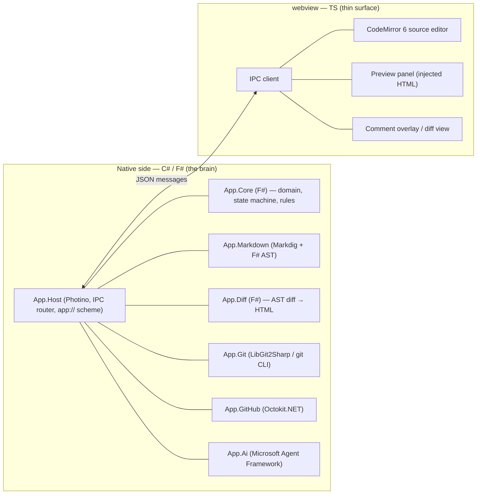
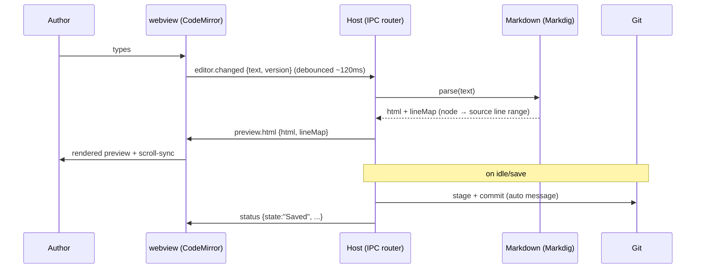

# 02 — Architecture

## Stack (fixed)

| Concern | Choice | Notes |
|---------|--------|-------|
| Desktop shell | **Photino.NET** | Window + system WebView2 + string IPC. Light; cross-platform escape hatch. |
| Core language | **C# and F#** | F# for the domain model, state machine, AST diff, rules. C# for integrations. |
| Runtime | **.NET 9/10** | — |
| Markdown parse/render | **Markdig** | CommonMark + extensions; precise source spans (`UsePreciseSourceLocation`). |
| Semantic diff | **custom, F#** | Diff over an F# DU derived from the Markdig AST. |
| Git | **LibGit2Sharp** (+ git CLI shell-out for tricky ops) | — |
| GitHub API | **Octokit.NET** | PRs, review comments, reviewers, file contents/blobs. |
| AI agent | **Microsoft Agent Framework** | GA since 2026-04-03; first-party Anthropic Claude connector; native MCP. |
| Editor (webview) | **CodeMirror 6** | Source editing + selection/cursor; the only substantial TS. |
| Preview (webview) | plain DOM | Renders HTML computed natively; no Markdown logic in JS. |
| Webview build | **esbuild** (or Vite) | Bundles the small TS surface. |

### Why Photino over WPF / WinForms

The whole UI is essentially one webview (editor + preview + comments + diff + chat). A heavy
UI framework would be 95% unused. Photino is a thin host that fits a webview-centric app.
Cost vs. raw WebView2: narrower native dialog/menu/tray API, and the system-webview model
means a future Linux/macOS port would use WebKitGTK / WKWebView (rendering differences are
tolerable for Markdown but not free). If Photino's thinness becomes a problem and
cross-platform is abandoned, the fallback is **WinForms + WebView2** (not WPF): lighter,
full WebView2 API, one-line native dialogs.

## The native ↔ webview split



The webview never parses Markdown, never talks to git or GitHub, never calls the AI. It
emits intents (text changed, image pasted, button clicked) and renders what it is told.

## Module layout

```
SpecDesk.sln
	src/
		SpecDesk.Host/          # C#  — Photino bootstrap, window, IPC router, app:// handler
		SpecDesk.Core/          # F#  — domain model, document lifecycle state machine,
		                        #       image-rule engine, deterministic commit/PR text
		SpecDesk.Markdown/      # C#+F# — Markdig wrapper, AST projection to F# DU, HTML render
		SpecDesk.Diff/          # F#  — AST diff, diff-to-HTML rendering
		SpecDesk.Git/           # C#  — LibGit2Sharp + git CLI wrapper
		SpecDesk.GitHub/        # C#  — Octokit.NET wrapper (PRs, reviews, comments, contents)
		SpecDesk.Ai/            # C#  — Microsoft Agent Framework agent, tools, MCP
		SpecDesk.Contracts/     # C#  — IPC message DTOs shared across modules
		webview/                # TS  — CodeMirror, preview, overlay, IPC client (esbuild)
	tests/
		SpecDesk.Core.Tests/    # F#
		SpecDesk.Diff.Tests/    # F#
		SpecDesk.Markdown.Tests/
```

Split rationale: F# carries everything that is fundamentally tree- and rule-shaped (AST,
diff, state machine, image rules) where pattern matching and exhaustiveness pay off. C#
carries the integration libraries, which are all C#-first (Photino, Octokit, LibGit2Sharp,
MAF).

## Process model

Single process. Photino runs the UI thread + WebView2. Long operations (fetch, push, PR
create, AST diff of large files, agent calls) run on the thread pool and post results back
to the webview via the IPC router. No separate server, no localhost port, no embedded DB.

State lives in two places:
- **The git repo on disk** is the source of truth for document content and history.
- **A small local app store** (SQLite or a JSON sidecar under `%AppData%`) holds only
  app-level state: known repos, per-document local comment drafts not yet synced, last-known
  PR mapping, agent settings. Nothing authoritative — it can be rebuilt from git + GitHub.

## Serving local assets to the webview

The preview must show local images referenced by relative Markdown links. `file://` runs into
webview security/CORS. Solution: register a **custom `app://` scheme** in Photino whose
handler serves files from the active repo working directory. At render time the Markdown
pipeline rewrites `` → `app://repo/images/foo.png`. (This is the Photino
equivalent of WebView2's `SetVirtualHostNameToFolderMapping`, done manually via the scheme
handler.)

## End-to-end data flow (editing)



## Cross-cutting concerns

- **Threading / IPC ordering.** Messages carry a monotonic `version` for editor content so a
  late preview result for stale text is dropped. Request/response pairs match on `id`.
- **Cancellation.** Editor-change → preview is debounced and cancellable; a newer change
  cancels the in-flight parse. (Relevant given prior async/cancellation-token race work.)
- **Error surfacing.** Native errors become `error`/`toast` messages in plain language;
  git/GitHub/agent failures never leak stack traces to the author.
- **Testing.** Core, Diff, Markdown are pure and unit-tested in F#/C# without the webview.
  The webview is integration-tested with a mock IPC host.
