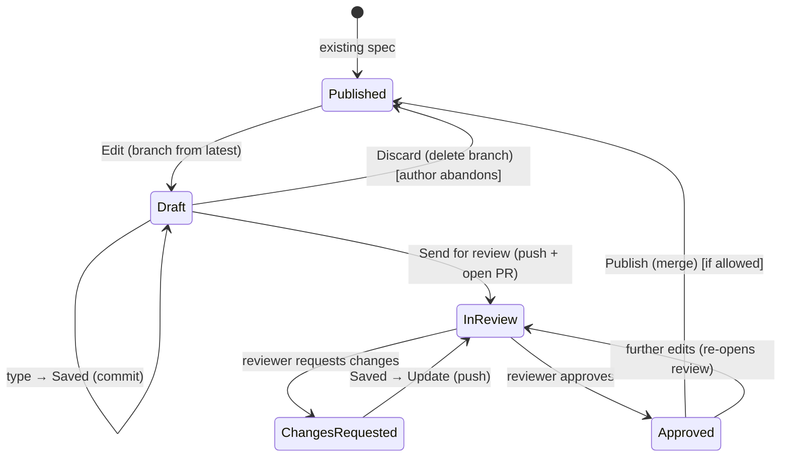

# 04 — Git / GitHub Workflow

This is the part designed specifically for non-developers coming from editing `.doc` files in
Office 365. Goal: feel as close to that as the GitHub reality allows, without lying about what
is happening underneath. Real git/GitHub the whole way; only the **vocabulary and the number
of decisions** are reduced.

## The Office 365 mental model we are emulating

In Office, an author:
1. opens a document,
2. types — it autosaves,
3. optionally sends it for review / turns on track changes,
4. sees comments, responds, edits,
5. it gets finalized.

There is no branch, commit, push, pull, merge, or conflict marker in that world. We preserve
the *feel* of those five steps and map them onto git/GitHub.

## Vocabulary mapping

| Author sees | Git / GitHub reality | Visible? |
|-------------|----------------------|----------|
| **Edit** | fetch latest, create working branch from published version | action button |
| **Saved** (automatic) | local commit | status text |
| **Send for review** | push branch + open PR (title/description generated) | action button |
| **In review** | PR open, awaiting reviewers | status |
| inline **comment** | PR review comment | inline UI |
| **Changes requested** | PR review state = changes requested | status |
| **Update** (automatic on save while in review) | push more commits to the PR | implicit |
| **Approved** | PR approved | status |
| **Publish** | merge PR | action button (if permitted) |
| **Published** | PR merged | status |
| **Sync** (background) | fetch / prune | invisible |
| "Someone else changed this too" | rebase/merge conflict | reconciliation dialog |

What stays **completely invisible**: branch names, commit SHAs, push, fetch, rebase, the word
"pull request" itself (it is "review").

## Document lifecycle

### 1. Browse & open

The author sees a plain file tree of the repo's spec files (filtered to `.md`, hiding repo
plumbing). They pick one. No git action yet — the app keeps a background-fetched local clone
fresh via **Sync**.

### 2. Edit

Clicking **Edit**:
- ensures the local repo is fresh (fetch),
- silently creates a working branch from the latest published version (pattern from
  `.spectool.toml`, e.g. `spec/<docSlug>-<date>`),
- shows status **Draft — only you can see this**.

The author never names or sees the branch.

### 3. Write (autosave-like saving)

Edits commit locally on idle/debounce, exactly like Office autosave. Status cycles
**Saving… → Saved just now**. Commit messages are auto-generated (deterministic template
early, agent later) and are *not* shown unless the author opens an optional "history" panel.
Multiple small commits are fine; they can be squashed at publish if the repo prefers.

### 4. Send for review

A single button. The app:
- pushes the working branch,
- opens a PR with a generated **title + description** (editable before submit — this is the
  one place the author confirms text),
- assigns reviewers (default from `.spectool.toml` `reviewers`, or CODEOWNERS, or author
  picks from a list),
- status becomes **In review**.

### 5. Respond to feedback

Reviewers leave inline comments (see [07-review-experience.md](07-review-experience.md)). The
author sees them in the same editor, replies, and edits. Saving while In review automatically
**Update**s the PR (pushes). Status flips **Changes requested → In review** on update.

### 6. Publish

When approved:
- if `allow-author-publish = true`, the author sees a **Publish** button (merge),
- otherwise a maintainer publishes; the author just sees **Approved** then **Published**.

After publish the working branch is deleted automatically.

## Conflict handling (the dangerous part, made gentle)

Authors must never see `<<<<<<<` markers. Strategy, in order of prevention:

1. **Prevent drift.** Branch is created from the latest published version at edit-start, and
   background Sync keeps the base fresh. The window for conflict is small.
2. **Rebase on send/update.** Before pushing, rebase the working branch onto the latest base.
	- Clean → proceed silently.
	- Conflict → do **not** show git output. Open a **"Someone else changed this too"**
	  dialog: per conflicting section, a simple side-by-side (your version | their version)
	  with choices **Keep mine / Keep theirs / Combine (manual edit) / Ask for help**.
3. **Escape hatch.** "Ask for help" pings a maintainer (configurable) and leaves the PR in a
   clearly-labelled "needs help merging" state. Pragmatic for v1: never block the author on a
   merge they cannot reason about.

Soft-lock awareness: if another **open PR** already touches the same file, warn at edit-start
("X is already editing this spec — your changes may overlap"). GitHub cannot hard-lock, so
this is advisory only, to reduce collisions rather than prevent them.

## New / rename / delete

- **New spec:** "New spec" → choose location and name within the rules the repo allows (the
  app proposes a path), optional template. Same Draft → review → publish flow.
- **Rename / delete:** also reviewable changes (a rename is a move + link-fixups; the app can
  offer to update inbound links). Default: go through review like any edit.

## Decisions to lock during implementation

- **Auth model:** GitHub App vs OAuth device flow vs PAT. A GitHub App gives the cleanest
  permission story and per-repo install but is more setup; device flow is simplest for
  individuals. Recommend GitHub App for org-wide rollout.
- **Squash on publish?** Cleaner history for developers; configurable per repo.
- **Who merges:** `allow-author-publish` default `false` for safety; flip per repo where
  managers own their specs end-to-end.
- **Draft PRs first?** `draft-first` opens the PR as a draft until the author explicitly marks
  ready — useful if "send for review" should not immediately notify reviewers.
