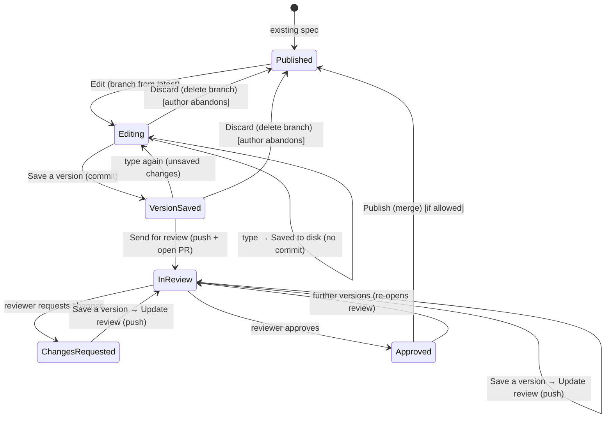

# 04 — Git / GitHub Workflow

This is the part designed specifically for non-developers coming from editing `.doc` files in
Office 365. Goal: feel as close to that as the GitHub reality allows, without lying about what
is happening underneath. Real git/GitHub the whole way; only the **vocabulary and the number
of decisions** are reduced.

## The Office 365 mental model we are emulating

In Office, an author:
1. opens a document,
2. types — it **autosaves to disk continuously** (nothing is ever lost),
3. occasionally marks a **named version** in Version History worth coming back to,
4. optionally sends it for review / turns on track changes,
5. sees comments, responds, edits,
6. it gets finalized.

There is no branch, commit, push, pull, merge, or conflict marker in that world. We preserve
the *feel* of those steps and map them onto git/GitHub.

Two distinct ideas from Office matter here and we keep them separate:

- **Autosave** is continuous, silent, and to the local file only — its only job is "never lose
  the author's typing". In our world it writes the working copy to disk; it does **not** commit.
- **Save a version** is a deliberate, occasional act — "this state is worth a name". In our
  world *this* is the commit, and it is the only place a commit ever happens. The author writes
  (or accepts a generated) short note describing the version — that note is the commit message.

This is the core correction to the earlier model: we do **not** auto-commit on every idle.
Auto-committing produced noisy, meaningless history and took the "when is this a real version?"
decision away from the author. Committing is now an **explicit** action.

## Vocabulary mapping

| Author sees | Git / GitHub reality | Visible? |
|-------------|----------------------|----------|
| **Edit** (+ a draft name) | fetch latest, create working branch from published version | action button; the author confirms/edits a generated draft name |
| **Saved** (automatic, continuous) | write working copy to disk — **no commit** | status text |
| **Save a version** (+ a short note) | `git commit` with the note as the message | action button |
| **Send for review** | push branch + open PR (title/description generated, editable) | action button (offered after the first version is saved) |
| **In review** | PR open, awaiting reviewers | status |
| inline **comment** | PR review comment | inline UI |
| **Changes requested** | PR review state = changes requested | status |
| **Update review** | push the newly-saved versions to the PR | action button (offered after saving a version while in review) |
| **Approved** | PR approved | status |
| **Publish** | merge PR | action button (if permitted) |
| **Published** | PR merged | status |
| **Sync** (background) | fetch / prune | invisible |
| "Someone else changed this too" | rebase/merge conflict | reconciliation dialog |

What stays **completely invisible**: commit SHAs, push, fetch, rebase, the word "pull request"
itself (it is "review"). What is now **deliberately visible** (a considered departure from "hide
everything"): the act of saving a version and its one-line note, and the **draft name** the author
gives when they start editing (the working branch's name). The author never sees the words *commit*
or *branch*, but they do choose *when* a version exists, *what it says*, and *what the draft is
called* — a generated default is offered for each, so accepting it is one keystroke, but only the
author knows what is meaningful. The note and draft name are what make the history and the eventual
review legible.

The document is **read-only until Edit**: with no working branch there is nowhere safe to put
changes, so the editor only becomes writable once Edit has forked the draft. This makes the gate
obvious (you must start a draft before you can type) and prevents edits that would otherwise be
silently discarded.

### The explicit chain (Save a version → Send / Update)

Saving a version is one button. Once a version exists the app **offers the next step inline**,
it never performs it silently:

1. **Save a version** — commit the working copy with the (generated, editable) note.
2. Immediately after, offer **Send for review** if no review exists yet (push + open PR), or
   **Update review** if one does (push the new versions). The author can decline and keep saving
   local versions; nothing leaves the machine until they choose to share.

So the progression is **autosave (disk) → Save a version (commit) → Send for review / Update
(push + PR)** — three levels, each more deliberate than the last, each an explicit author choice
except the first.

## Document lifecycle

**Editing** vs **Version saved** is the local distinction the status surface must show: *Editing*
means there are unsaved changes on disk (a commit would capture something); *Version saved* means
the working copy matches the last saved version. This is the same "you have unsaved changes" dot
every editor shows — here it tracks the working-tree-vs-HEAD state, not a file-vs-disk state
(the file is always flushed to disk by autosave).

### 1. Browse & open

The author sees a plain file tree of the repo's spec files (filtered to `.md`, hiding repo
plumbing). They pick one. No git action yet — the app keeps a background-fetched local clone
fresh via **Sync**.

### 2. Edit

Until this point the editor is **read-only** — but fully navigable: the caret, selection, and
keyboard navigation all work, only modification is blocked. Clicking **Edit** (or simply *starting
to type* in the read-only document, which is treated as "I want to edit"):
- ensures the local repo is fresh (fetch),
- prompts for a **draft name**, prefilled with a generated default from `.spectool.toml`
  (e.g. `spec/<docSlug>-<date>`); the author keeps it (one keystroke) or types their own. The name
  is cleaned to a valid form *as it is typed* (backslashes → `/`, spaces and other illegal
  characters → `_`) and the host sanitizes again on submit; an empty name falls back to the default,
- creates a working branch with that name from the latest published version,
- makes the editor writable and shows status **Draft — only you can see this**.

This is the one place the working branch's name is author-chosen rather than hidden — a small,
deliberate exception that gives the author a recognizable handle on their draft without exposing
the word "branch". Cancelling the prompt leaves the document read-only and Published.

### 3. Write (continuous autosave to disk)

Edits autosave to the working copy on idle/debounce — exactly like Office autosave, and like
Office it is purely a "never lose typing" mechanism. Status shows **Saving… → Saved** and, once
there are changes beyond the last saved version, **Unsaved changes** (the dirty indicator). **No
commit happens here.** The author can type for an hour across many sittings and there is still
just one working copy on disk and (at most) the versions they chose to save.

### 4. Save a version (explicit commit)

A button the author presses when a state is worth keeping. The app:
- proposes a short **note** describing the change (deterministic template early — e.g. derived
  from the doc slug and the sections touched; the agent drafts a better one later),
- lets the author **edit the note** before confirming (this is the author's commit message, in
  plain words). The note is a single line by default but expands into a multi-line editor on
  demand (an expand affordance or the Down arrow), so a longer description is possible when wanted,
- commits the working copy (document **and** any pasted image assets — see
  [06-images.md](06-images.md)) on the working branch,
- status becomes **Version saved**,
- then **offers** the sharing step inline (see below) — never taking it automatically.

Saving several versions before sharing is normal and encouraged; they read as an honest history
of how the change developed, and can be squashed at publish if the repo prefers
(`commit.squash-on-publish`).

### 5. Send for review

Offered right after the first **Save a version**, and always available as a button. The app:
- pushes the working branch,
- opens a PR with a generated **title + description** (editable before submit — assembled from
  the saved version notes; this is where the author confirms the outward-facing text),
- assigns reviewers (default from `.spectool.toml` `reviewers`, or CODEOWNERS, or author
  picks from a list),
- status becomes **In review**.

> **Implementation status:** the round-trip, reviewer assignment, and the author-facing
> **edit-before-submit** of the PR title/description are all wired. Send for review opens an inline
> prompt (the `pr.suggested` seam, [09-ipc-protocol.md](09-ipc-protocol.md)) seeded with the title (the
> last version note, falling back to the document name) and a short description; the author confirms or
> edits them, then the review opens with that text. A blank title falls back to the generated one
> (GitHub rejects an empty title); an empty description is honoured.

### 6. Respond to feedback

Reviewers leave inline comments (see [07-review-experience.md](07-review-experience.md)). The
author sees them in the same editor, replies, and edits. After saving a new version while In
review, the app offers **Update review** (push the new versions to the PR). Status flips
**Changes requested → In review** on update. While editing, the author can also see and compare
against other open reviews touching the same file — see
[07-review-experience.md](07-review-experience.md) Part C.

### 7. Publish

When approved:
- if `allow-author-publish = true`, the author sees a **Publish** button (merge),
- otherwise a maintainer publishes; the author just sees **Approved** then **Published**.

After publish the working branch is deleted automatically.

## Conflict handling (the dangerous part, made gentle)

Authors must never see `<<<<<<<` markers. Strategy, in order of prevention:

1. **Prevent drift.** Branch is created from the latest published version at edit-start, and
   background Sync keeps the base fresh. The window for conflict is small.
2. **Rebase on send/update.** Before pushing, rebase the working branch onto the latest base.
	- Clean → proceed silently.
	- Conflict → do **not** show git output. Open a **"Someone else changed this too"**
	  dialog: per conflicting section, a simple side-by-side (your version | their version)
	  with choices **Keep mine / Keep theirs / Combine (manual edit) / Ask for help**.
3. **Escape hatch.** "Ask for help" pings a maintainer (configurable) and leaves the PR in a
   clearly-labelled "needs help merging" state. Pragmatic for v1: never block the author on a
   merge they cannot reason about.

Soft-lock awareness: if another **open PR** already touches the same file, warn at edit-start
("X is already editing this spec — your changes may overlap"). GitHub cannot hard-lock, so
this is advisory only, to reduce collisions rather than prevent them. This warning is the entry
point to **comparing against the in-flight PR** — the author can open its proposed version side
by side with their own work before deciding how to proceed (see
[07-review-experience.md](07-review-experience.md) Part C).

## New / rename / delete

- **New spec:** "New spec" → choose location and name within the rules the repo allows (the
  app proposes a path), optional template. Same Draft → review → publish flow.
- **Rename / delete:** also reviewable changes (a rename is a move + link-fixups; the app can
  offer to update inbound links). Default: go through review like any edit.

## Decisions to lock during implementation

- **Auth model:** GitHub App vs OAuth device flow vs PAT. A GitHub App gives the cleanest
  permission story and per-repo install but is more setup; device flow is simplest for
  individuals. Recommend GitHub App for org-wide rollout.
- **Squash on publish?** Cleaner history for developers; configurable per repo.
- **Who merges:** `allow-author-publish` default `false` for safety; flip per repo where
  managers own their specs end-to-end.
- **Draft PRs first?** `draft-first` opens the PR as a draft until the author explicitly marks
  ready — useful if "send for review" should not immediately notify reviewers.
