# SpecDesk — Design Concept & Developer Guide

> A calm, document-first **Windows desktop app** that lets non-technical authors edit
> Markdown specifications stored in GitHub — **without ever seeing git**. This document is
> the source of truth a developer agent should follow when building any new PoC, so each
> increment moves toward the same final interface.
>
> **How to use this file:** read the text; it is authoritative. The screenshots are
> reference renders of the agreed mockups. The live, themeable sources are the
> `*.dc.html` files (`SpecDesk Concept`, `SpecDesk Design Guide`, `SpecDesk Screens`,
> `SpecDesk App`, plus the `SpecDesk Design Dossier` overview). When the text and an
> image disagree, the text wins.

---

## 1. What we're building

SpecDesk wraps a Markdown editor (three modes: **source / split / formatted**), automated
git/GitHub operations hidden behind plain-language actions, inline review comments, a
rendered (semantic) diff, automated image handling, and an embedded AI assistant. It should
feel like *editing a document in Office*: continuous autosave, an explicit "save a version",
a single "send for review" gate, plain-language status — and **no merge-conflict markers or
git jargon ever**.

- **Primary users — authors/managers.** Come from Office; not developers; zero tolerance for
  git terms or modal complexity.
- **Secondary — reviewers.** More technical, but stay inside the same plain-language world.
- **Platform.** Photino + WebView2 (Chromium). The whole UI is HTML/CSS/TS in **one webview**,
  running **offline** in a single resizable window (target ≥ 1024×700). No mobile/touch.
- **Editor.** CodeMirror 6 (source/split); a ProseMirror-family engine later for WYSIWYG.
  Both must share one visual language. The rendered preview is plain HTML produced natively
  and **styled only by our CSS**.

---

## 2. Design principles

1. **No git vocabulary, ever.** Authors see *Edit, Saved, Save a version, Send for review,
   In review, Changes requested, Approved, Publish*. Never *branch/commit/push/PR/merge/
   rebase/conflict*. The single deliberate exception is the plain-language **version note**.
2. **Document-first.** The content is the hero; chrome is quiet and recedes. Tint and shadow
   separate panels — they never decorate.
3. **Markdown is the single source of truth.** The rendered surface reads like a typeset
   document, not a web page. It is reused across preview, formatted mode, diff and
   comparison — style it once, beautifully.
4. **Calm lifecycle.** State changes are legible at a glance and never alarming. Errors are
   plain language, never stack traces.
5. **Office-familiar, not IDE.** Toolbar, version history, margin comments, a review mode.
6. **Progressive disclosure.** Rich review / PR / CI / AI capability is available but only
   what's needed is on screen. Everything heavy lives in panels you open and close.

---

## 3. Visual direction

Three directions were explored; **Direction B — "Desk"** was chosen: a structured,
lightly-tinted app with docked panels. **Direction A — "Paper"** ships as an approved
**alternate warm light theme**; a **dark theme** is defined alongside. Shared across all:

- **UI font:** `system-ui, "Segoe UI"` (native on Windows, zero bundle weight).
- **Document:** **serif headings** (`Constantia` → Georgia) + **sans body** (same as UI).
- **Editor/code:** `Cascadia Code` → Consolas.
- One **blue accent** (`#2F6DB5`), Office-balanced density.

All three themes are driven by the **same CSS custom properties** (below); only the values
change. Default `:root` = cool; `[data-theme="warm"]` and `[data-theme="dark"]` override.

---

## 4. Foundations — design tokens

Copy this verbatim into the app's global stylesheet. Theme by toggling
`document.documentElement[data-theme]`.

```css
/* ---- LIGHT · COOL (default · Direction B) ---- */
:root{
  --font-ui: system-ui,"Segoe UI",-apple-system,sans-serif;
  --font-doc-head: Constantia,"Iowan Old Style","Palatino Linotype",Georgia,serif;
  --font-mono: "Cascadia Code","Cascadia Mono",Consolas,ui-monospace,monospace;

  --canvas:#f7f8fa; --surface:#fff; --surface-raised:#fafbfc; --surface-sunken:#eceef1;
  --panel:#f1f3f5; --panel-header:#e4e7eb;
  --toolbar-chrome:#eef1f4; --mode-rail:#65717f; --mode-rail-hover:#6b7785; --mode-rail-active:#376a9e; --mode-rail-border:#535e6b; --status-chrome:#596571;
  --mode-rail-text:#f2f4f6; --mode-rail-text-strong:#fff;
  --border:#e6e9ec; --border-strong:#dce0e4;
  --text-strong:#1c1f23; --text:#2b2f34; --text-muted:#6a7077; --text-faint:#9a9fa6;

  --accent:#2f6db5; --accent-hover:#2a619f; --accent-active:#245488;
  --accent-soft:#eaf1f9; --accent-soft-border:#cfe0f3; --on-accent:#fff; --focus-ring:#2f6db5;

  --ok-fg:#2f7d54; --ok-dot:#3a9d68; --ok-bg:#e9f3ec; --ok-border:#c8e6d3;        /* saved / approved */
  --warn-fg:#a17d1e; --warn-dot:#d6a72e; --warn-bg:#fbf3df; --warn-border:#f0e2bb;  /* unsaved */
  --info-fg:#4f56c5; --info-dot:#5a61d6; --info-bg:#eeecfa; --info-border:#d4d2f3;  /* in review */
  --danger-fg:#bd5a2e; --danger-dot:#d4703f; --danger-bg:#fbeee6; --danger-border:#f2d6c4; /* changes requested */
  --edit-fg:#2f6db5; --edit-bg:#eaf1f9; --edit-border:#cfe0f3;                       /* editing */
  --neutral-fg:#6a7077; --neutral-bg:#fff; --neutral-border:#e2e5e8;                 /* read-only / draft */
  --ink-fg:#e8eaed; --ink-bg:#23272e;                                                /* published */

  /* diff */
  --add-bg:#e9f4ee; --add-border:#3a9d68; --add-text:#1f6b43; --add-hl:#bfe6cd; --add-gutter:#eef7f1;
  --del-bg:#fbeef0; --del-border:#d6586f; --del-text:#8f3146; --del-hl:#f4c4cf; --del-gutter:#fcf0f2;
  --mov-bg:#f6f1fb; --mov-border:#c8b3e0; --mov-text:#7a4fb0;

  /* editor */
  --ed-gutter:#b9c0c8; --ed-text:#2b2f34; --ed-heading:#2f6db5; --ed-marker:#7a8794; --ed-active:#eef4fb;

  --shadow-card:0 1px 2px rgba(20,24,30,.12);
  --shadow-pop:0 10px 30px -12px rgba(28,32,40,.32);
  --shadow-panel:0 18px 44px -20px rgba(28,32,40,.30);

  --r-sm:6px; --r-md:8px; --r-lg:10px; --r-pill:20px;
  --dur-fast:120ms; --dur:160ms; --dur-slow:220ms; --ease:cubic-bezier(.4,0,.2,1);
}

/* ---- LIGHT · WARM (alternate · Direction A) — neutrals shift warm, hues unchanged ---- */
:root[data-theme="warm"]{
  --canvas:#faf8f2; --surface:#fff; --surface-raised:#fcfbf7; --surface-sunken:#f3efe6;
  --panel:#f3f0e9; --panel-header:#e7e3da;
  --toolbar-chrome:#efede7; --mode-rail:#6c6962; --mode-rail-hover:#74716a; --mode-rail-active:#376a9e; --mode-rail-border:#59564f; --status-chrome:#605d57;
  --mode-rail-text:#faf8f3; --mode-rail-text-strong:#fff;
  --border:#efece4; --border-strong:#e4e1d8;
  --text-strong:#23211c; --text:#3a382f; --text-muted:#7a766b; --text-faint:#9a968b;
  --accent-soft:#eef3f9; --accent-soft-border:#d6e3f1;
  --neutral-bg:#f2efe8; --neutral-fg:#7a766b; --neutral-border:#e6e2d6;
  --ed-gutter:#cfc8b6; --ed-text:#3c3a33; --ed-marker:#b89b4a; --ed-active:#f7f3e9;
}

/* ---- DARK ---- */
:root[data-theme="dark"]{
  --canvas:#15171b; --surface:#1c1f24; --surface-raised:#22262c; --surface-sunken:#2a2f36;
  --panel:#20242a; --panel-header:#292e35;
  --toolbar-chrome:#2a3038; --mode-rail:#414b58; --mode-rail-hover:#505c6a; --mode-rail-active:#3b6b99; --mode-rail-border:#596575; --status-chrome:#35404c;
  --mode-rail-text:#edf0f4; --mode-rail-text-strong:#fff;
  --border:#2c313a; --border-strong:#3a404a;
  --text-strong:#ecedef; --text:#c9cdd3; --text-muted:#8b9098; --text-faint:#5f656d;
  --accent:#5b9bd9; --accent-hover:#6fa9e0; --accent-active:#4f8cc9;
  --accent-soft:#1e2c3a; --accent-soft-border:#2f4a66; --on-accent:#0e1419; --focus-ring:#5b9bd9;
  --ok-fg:#6fc394; --ok-dot:#46a572; --ok-bg:#16291f; --ok-border:#27412f;
  --warn-fg:#d8b25a; --warn-dot:#c79a3a; --warn-bg:#2a2410; --warn-border:#433a1c;
  --info-fg:#a9adf0; --info-dot:#7b81e0; --info-bg:#21233a; --info-border:#363a5c;
  --danger-fg:#e09063; --danger-dot:#cf7544; --danger-bg:#2c1d15; --danger-border:#48301f;
  --edit-fg:#5b9bd9; --edit-bg:#1e2c3a; --edit-border:#2f4a66;
  --neutral-fg:#8b9098; --neutral-bg:#22262c; --neutral-border:#343a43;
  --ink-fg:#0e1419; --ink-bg:#cfd3d8;
  --add-bg:#16291f; --add-border:#46a572; --add-text:#7fce9f; --add-hl:#2c5a3e; --add-gutter:#13231a;
  --del-bg:#2c1820; --del-border:#cf5a74; --del-text:#e89bac; --del-hl:#5e2d3a; --del-gutter:#241419;
  --mov-bg:#241c30; --mov-border:#8a6fb8; --mov-text:#c2a8e6;
  --ed-gutter:#4d535c; --ed-text:#c9cdd3; --ed-heading:#5b9bd9; --ed-marker:#6d7a86; --ed-active:#22303d;
  --shadow-card:0 1px 2px rgba(0,0,0,.4);
  --shadow-pop:0 10px 30px -12px rgba(0,0,0,.55);
  --shadow-panel:0 18px 44px -20px rgba(0,0,0,.6);
}
```

### Typography

| Scale | Font | Size / line-height | Use |
|---|---|---|---|
| doc h1 | serif | 26–28 / 1.2, weight 600, `-0.01em` | document title |
| doc h2 | serif | 20 / 1.3, 600 | section |
| doc h3 | serif | 17 / 1.35, 600 | sub-section |
| doc body | sans | 15 / 1.7 | prose (1.75 in formatted page) |
| ui label | sans | 11, 600, `+.07em`, uppercase | panel section labels |
| ui base | sans | 13 | buttons, controls, panel body |
| ui input | sans | 14 | inputs |
| editor | mono | 13 | **Code: line-height 1.5–1.55 (tight)**, **Split: 1.7–1.85** |

> **Code vs Split spacing.** In **Code** mode lines are tight. The extra vertical space only
> appears in **Split**, where source rows are height-synced to the rendered side; the padding
> rows use a faint 45° hairline hatch (`--border`, ~50% opacity) so they read as service
> padding, never content.

### Spacing, radii, elevation, motion

- **Spacing:** 4px base — 4 · 8 · 12 · 16 · 20 · 24 · 32 · 40 · 48.
- **Radii:** `--r-sm 6` (buttons/inputs) · `--r-md 8` (cards/segmented) · `--r-lg 10` (panels/windows) · pill 20 (badges).
- **Elevation:** `--shadow-card` (segmented active, small cards) · `--shadow-pop` (comment cards, dialogs) · `--shadow-panel` (windows).
- **Motion:** 120ms hover · 160ms controls · 220ms panels; ease `cubic-bezier(.4,0,.2,1)`. Calm — no bounce, nothing over ~240ms.

---

## 5. Rendered-document stylesheet (the core reading surface)

The most-reused surface (preview, formatted mode, diff, comparison). Rules:

- Headings: serif, 600, tight tracking. Body: sans 15/1.7. Lists: 22px indent.
- Tables: 2px header underline (`--border-strong`), 1px row hairlines (`--border`). **No
  vertical rules, no zebra.**
- Blockquotes: serif-italic, `--text-muted`, 3px left rule (`--border-strong`).
- Inline code: `--surface-sunken` bg, 4px radius, mono ~0.88em. Code blocks: same bg, 8px
  radius, 1px border, mono 13/1.6.
- Images: `max-width:100%`, centered, 6px radius. Links: `--accent` with a hairline underline.
- **Caret-matched block highlight** = a 2px-inset `--accent-soft` wash (replaces the old
  yellow). Hover block = `--surface-raised`.
- Formatted-page mode: a white "page" (max measure ~64–68ch) centered on `--canvas` with
  `--shadow-card`.

---

## 6. Editor theme (CodeMirror 6)

- Background `--surface`; gutter numbers `--ed-gutter`; the active line's number lifts to
  `--accent`. Active line bg `--ed-active`; selection = accent at low alpha.
- Markdown syntax: headings `--ed-heading` weight 600; list/quote markers `--ed-marker`;
  everything else `--ed-text`.
- Height-sync spacer rows: faint diagonal hatch (see §4 note).

---

## 7. Components (build these from the tokens)

- **Buttons** — height ~30px, radius 6. *Primary* = accent fill (one per context); *secondary*
  = `--surface` + `--border-strong`; *ghost* = muted text, transparent; *danger* = soft danger
  fill. Hover deepens; focus shows a 2px `--focus-ring` outline at 2px offset.
- **Segmented control** (view switch) — sunken track, active segment a white card with
  `--shadow-card`. `role="radiogroup"` / `aria-checked`. Binary options use a switch.
- **Inputs / textarea** — `--surface`, `--border-strong`, radius 6; focus ring.
- **Toolbars** — the global toolbar carries repository / current version / document-path context,
  document search, notifications, panel controls, and the account menu only. Markdown lifecycle actions,
  Wrap, Show changes, and the Code / Split / Formatted switch live in the editor view's own wrapping
  toolbar, so they disappear whenever another central view replaces the editor.
- **Account menu** — a compact avatar trigger opens a keyboard-navigable `role="menu"` with Settings,
  Help, appearance, diagnostics, review, connection, and Sign out actions according to availability.
- **Inline prompt bars** — appear under the toolbar. *Name-a-draft* bar = `--accent-soft`
  (a beginning); *describe-your-changes / version note* bar = `--warn` tint (a checkpoint),
  with a `⌄` expander to a multi-line note. **This is the only place a commit-like idea
  surfaces — always in plain words.**
- **Destructive confirmation** — the first Delete/Remove action expands a danger-tinted block directly
  beneath that exact row or menu item. It states what remains untouched and exposes a text-labelled red
  **Confirm deletion** button; Escape, outside click, menu close, or entity change dismisses it. Focus moves
  into the block and returns to the trigger on cancellation, so colour is never the only warning.
- **Status / lifecycle badges** — toolbar status uses dot + label (no border); standalone
  badges use a bordered chip. One token family per state (see §8).
- **Side panels** — dock on the quiet grey `--panel` surface with a slightly stronger
  `--panel-header`, a 1px divider, and uppercase section labels. Their vertical mode rails use the
  dark `--mode-rail` family in every theme, with light AA-contrast icons and a non-colour active mark;
  collapsible sub-sections.
- **Comment thread** — card with avatar, name, relative time, reply, resolve, sync dot.
- **Diff chrome** — see §10. **AI confirm-gate** — preview the change → Edit → Confirm.

---

## 8. Lifecycle & vocabulary

> **The right column is internal only — never render it to authors.** The UI speaks
> exclusively in the left column's words.

| Author sees | Colour role | Internal (hidden) |
|---|---|---|
| **Edit** | edit / accent | branch from published |
| **Saved** (continuous) | neutral | write to disk, no commit |
| **Unsaved changes** | warning | dirty working copy |
| **Save a version** (+ note) | success | commit; note = message |
| **Send for review** | info | push + open PR |
| **In review** | info | PR open |
| **Changes requested** | danger (soft) | review: changes requested |
| **Approved** | success | PR approved |
| **Check for updates / Pull in** | neutral | fetch / pull |
| **Publish** | ink | merge the PR |

Conflicts surface as a gentle dialog (Keep mine / Keep theirs / Combine / Ask for help) —
understandable document differences, **never raw markers**.

---

## 9. Layout & the collapsible-panel architecture

Single resizable window. Vertically: **global context toolbar → optional inline prompt bar → content area
(editor toolbar + 1–2 panes, or another central view) → optional docked panel**, with a slim **status bar**
at the bottom.

The simple core stays simple because everything heavy is a panel you open/close:

- **Left rail (collapsible)** — the repository **file navigator**.
- **Right rail (collapsible)** — the open document's **outline** and the **AI assistant**, each a
  tool on the rail. The outline sits with the document it describes (the reading side), the assistant
  beside it.
- **Review / PR**, **checks**, **diff**, **comments**, **navigator** open in place.
- Either rail can drop to a **slim icon strip** so the document takes the room. Below ~1200px,
  rails become overlay drawers with a scrim. Only one heavy panel docked at a time.
- Splitters: 1px `--border`, widening to a 4px grab zone with an `--accent-soft` hover.

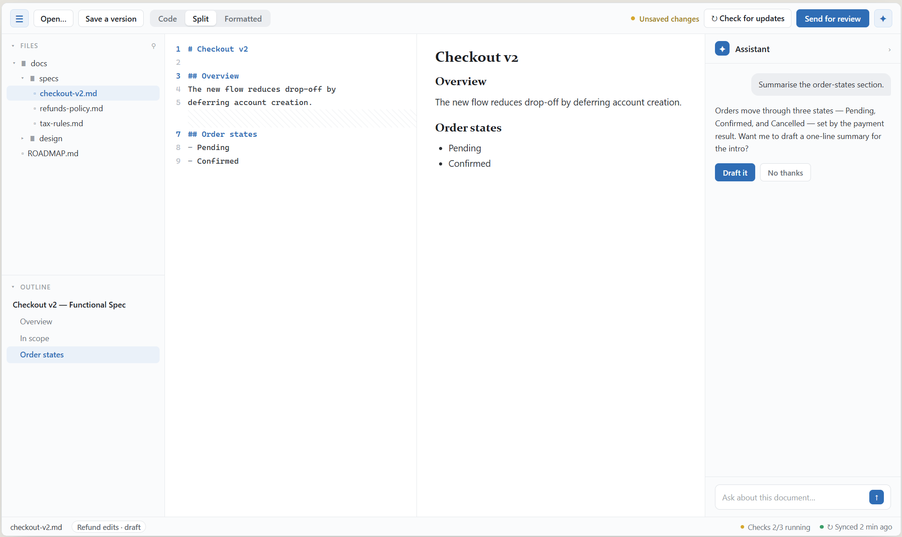\
> ▸ **Open the live mockup:** [`pages/01-app.html`](pages/01-app.html)
*All panels open: collapsible left rail (Files), Split editor in the centre, the document outline
and AI assistant docked right, status bar below.*

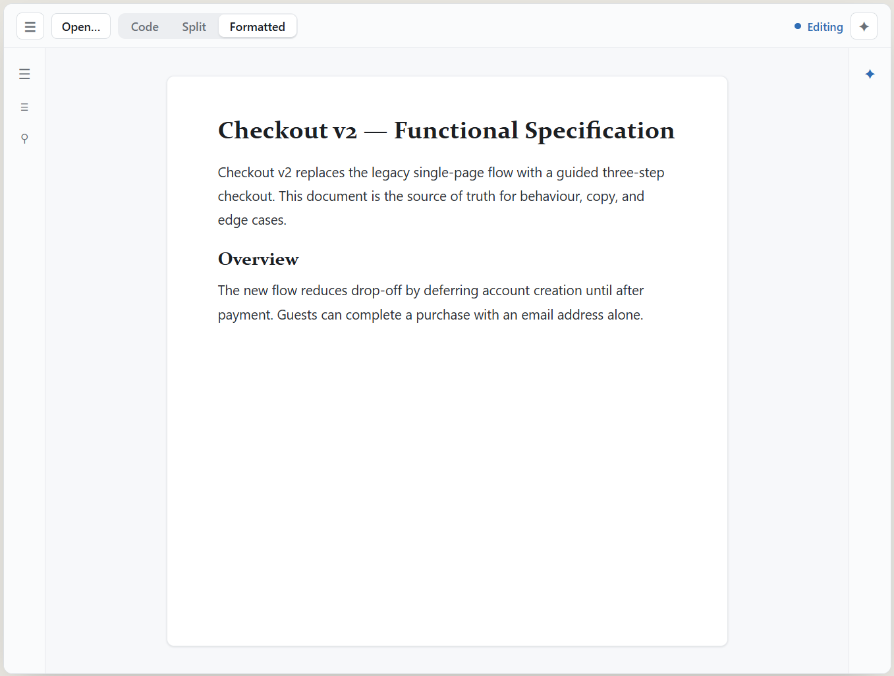\
> ▸ **Open the live mockup:** [`pages/02-app.html`](pages/02-app.html)
*Both rails collapsed to icon strips; the document takes the full width. One click restores a
panel.*

---

## 10. Screens

### 10.1 Editor — three modes

**Code** — tight source with line-number gutter, active-line highlight, a comment marker in
the gutter, and a bottom status bar.

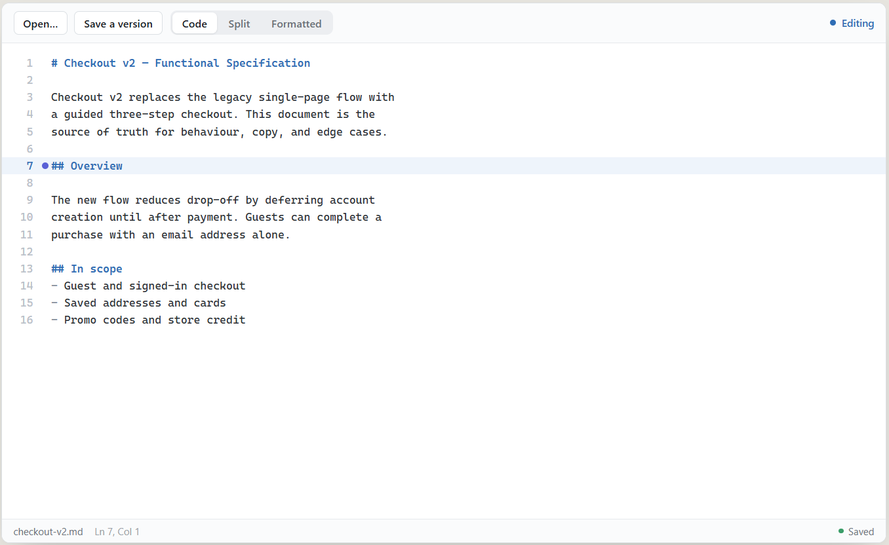\
> ▸ **Open the live mockup:** [`pages/01-screens.html`](pages/01-screens.html)

**Split** — source + rendered, scroll-synced; height-sync spacer rows; the version-note bar
shown while saving a version.

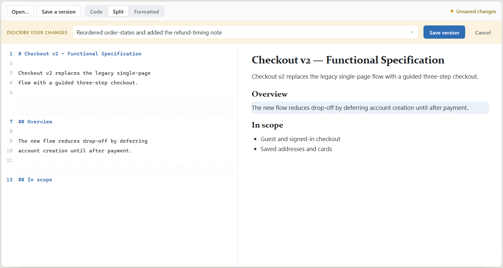\
> ▸ **Open the live mockup:** [`pages/02-screens.html`](pages/02-screens.html)

**Formatted (WYSIWYG)** — edit the typeset document directly; a formatting toolbar (bold,
italic, headings, lists, link, quote, code, table, image) appears; edits serialize back to
clean Markdown.

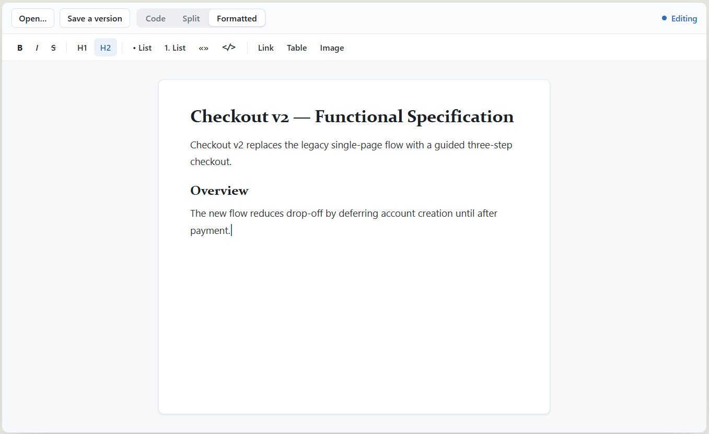\
> ▸ **Open the live mockup:** [`pages/03-screens.html`](pages/03-screens.html)

### 10.2 Review hub & status transitions

A change moves **Draft → Draft review → In review**, with reversible steps, **Approved →
Publish**, and **Close**. (Internally: local draft → draft PR → PR → merge.)

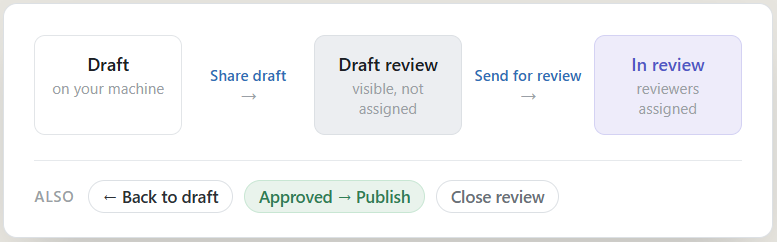\
> ▸ **Open the live mockup:** [`pages/03-app.html`](pages/03-app.html)

The right panel collects everything for the review in collapsible sections: a status stepper
+ transition actions, an editable **description**, **reviewers** + *Request review*, **labels**
+ *Add*, **Checks (CI)** with live pass/running/fail status, and an **activity** timeline.

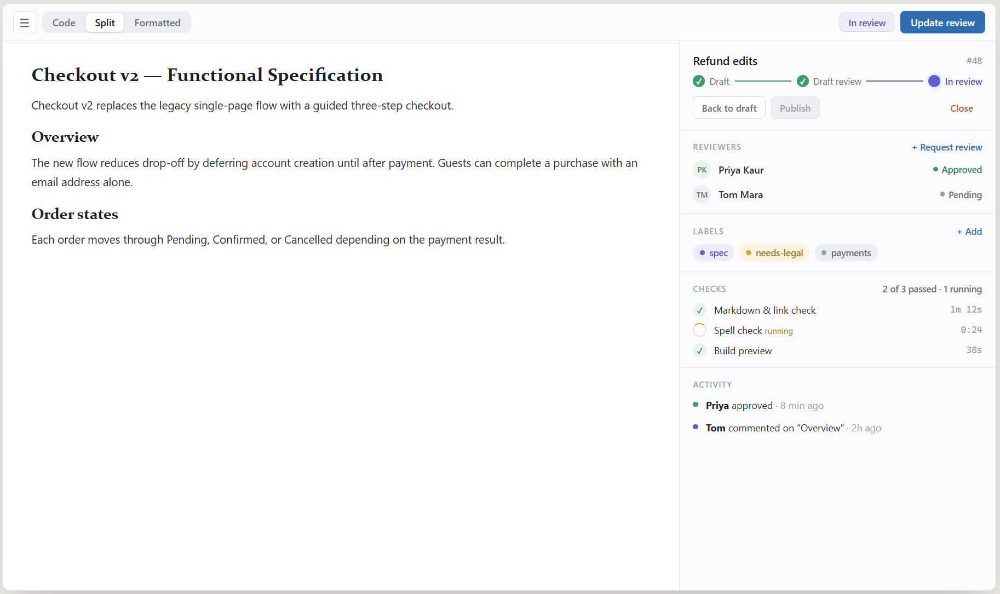\
> ▸ **Open the live mockup:** [`pages/04-app.html`](pages/04-app.html)

### 10.3 Diff & compare

**Source diff** — added (`+`, green) and removed (`−`, red) lines, plus **intra-line word
changes shown inline in one row** (struck old text + green new text) rather than a delete +
re-insert. Toggles for *Inline / Split lines* and *Rendered / Source*; a base selector to
**compare with published (main)**; in-flight comparison with other open versions.

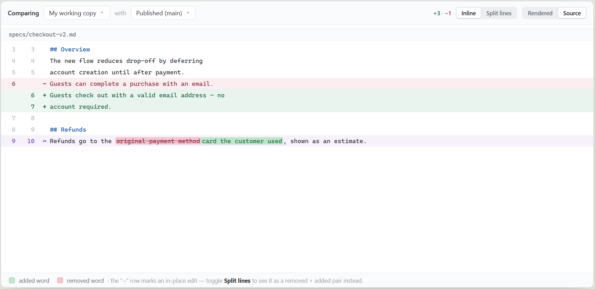\
> ▸ **Open the live mockup:** [`pages/05-app.html`](pages/05-app.html)

**Rendered semantic diff** — the same change shown structurally and typeset like the document
(added / removed / changed / **moved**), side-by-side or unified.

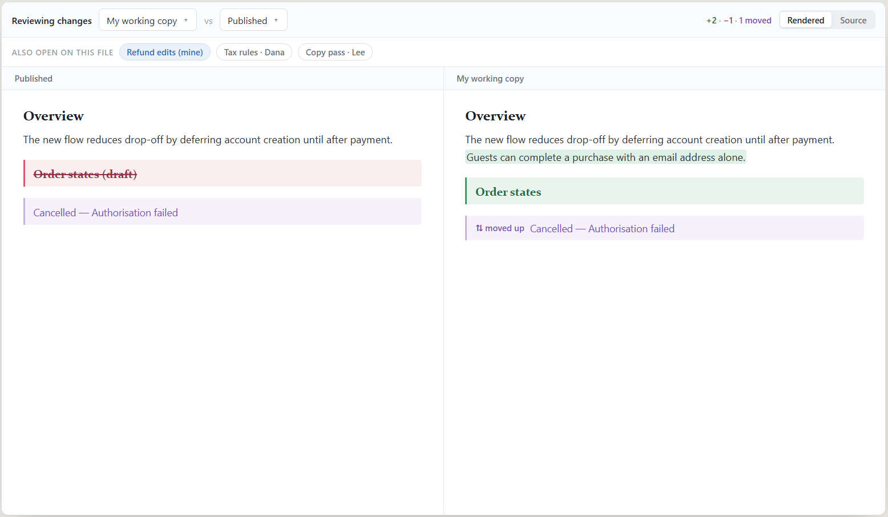\
> ▸ **Open the live mockup:** [`pages/04-screens.html`](pages/04-screens.html)

### 10.4 Comments

**Per-line comments** (reviewing someone else's change) — comment on any line; threads chain
like GitHub; submit the whole review as **Approve / Request changes / Comment**. Comments
collect into a pending review until submitted.

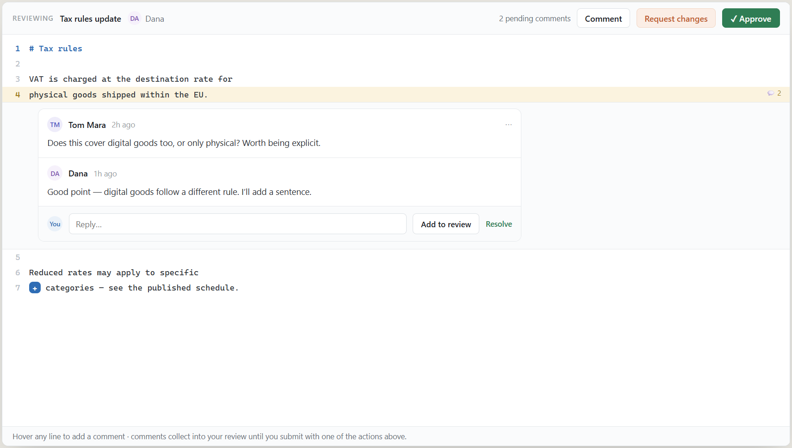\
> ▸ **Open the live mockup:** [`pages/06-app.html`](pages/06-app.html)

**Inline comments in formatted mode** — a highlighted span with a margin thread, two-way
synced with GitHub, replies and resolve, a "synced" indicator.

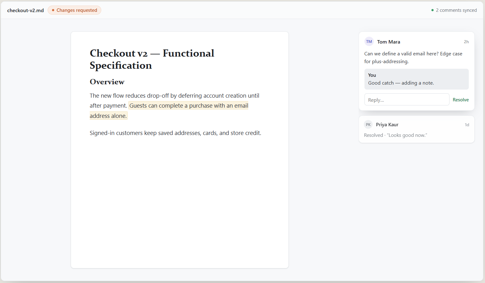\
> ▸ **Open the live mockup:** [`pages/05-screens.html`](pages/05-screens.html)

### 10.5 AI assistant

A docked, streaming chat. **Every mutating action it proposes passes a confirmation gate:** it
previews the change (in plain language / as a mini-diff), the author can Edit, and nothing
happens until Confirm. Assistant messages are quiet (no bubble fill); user messages get a
subtle `--surface-sunken` bubble.

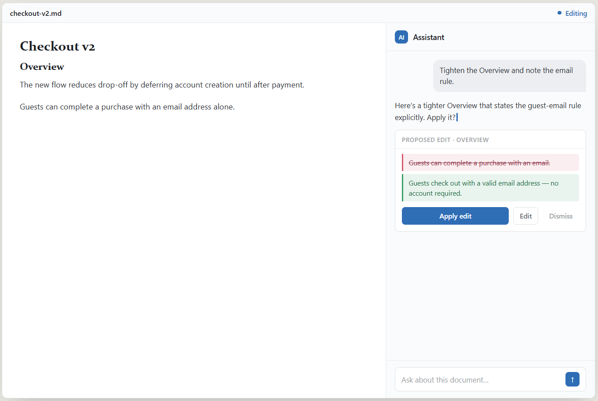\
> ▸ **Open the live mockup:** [`pages/06-screens.html`](pages/06-screens.html)

### 10.6 Reviews navigator & remote updates

**Navigator** — reviews grouped *My reviews*, *Assigned to me* (with a "Needs you" flag), and
*Open by link*. A collapsible left-rail panel; pairs with the file navigator.

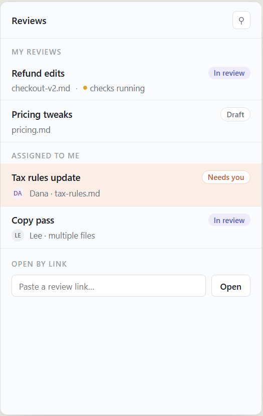\
> ▸ **Open the live mockup:** [`pages/07-app.html`](pages/07-app.html)

**Remote updates** — a quiet background check. When others have published, an *Updates
available → Pull in / Compare* card appears; an "Up to date / Check for updates" control; and
a co-editing hint. **The author's draft is never overwritten silently.**

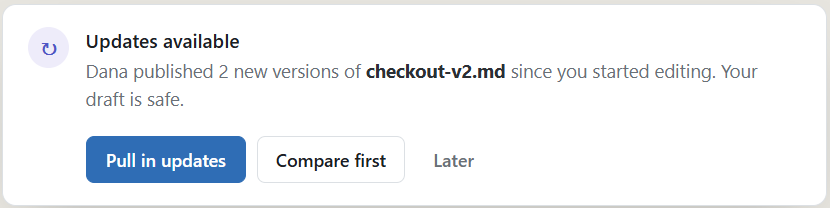\
> ▸ **Open the live mockup:** [`pages/08-app.html`](pages/08-app.html)

### 10.7 Dialogs & states

**Conflict reconciliation** — "Someone else changed this too" with *Keep mine / Keep theirs /
Combine / Ask for help*, shown as understandable side-by-side document differences, never
markers.

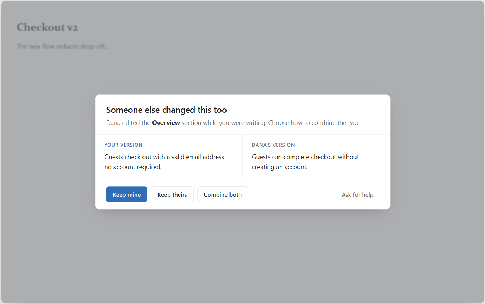\
> ▸ **Open the live mockup:** [`pages/07-screens.html`](pages/07-screens.html)

**Empty / first-run** — calm, centered: a one-line prompt, a single primary action ("Open a
spec"), and a recents list.

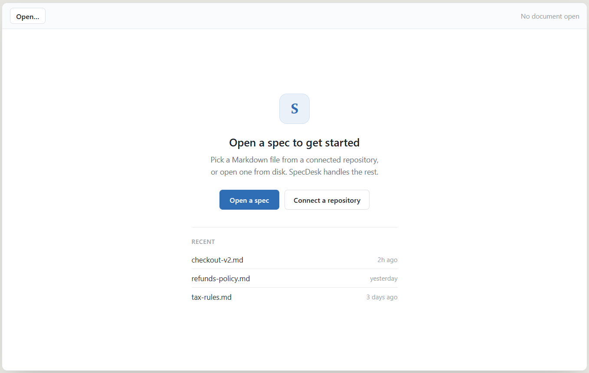\
> ▸ **Open the live mockup:** [`pages/08-screens.html`](pages/08-screens.html)

---

## 11. Accessibility

- WCAG **AA** contrast (4.5:1 body; ≥3:1 large text / chips). Each soft semantic fill is
  paired only with its darker `-fg` token, which is AA on that fill.
- Full keyboard reach; logical focus order; **always-visible** 2px focus ring.
- `aria-pressed` on toggles, `role="radiogroup"` on the segmented control,
  `aria-live="polite"` on the status region.
- **Never encode state by colour alone** — every lifecycle chip pairs colour with a word
  (and a dot).
- Icons: **Lucide** (MIT) — 1.5px stroke, 16/18/20px, `currentColor`. Never icon-only without
  a tooltip + `aria-label`.

---

## 12. Implementation recommendations

- **Theme via tokens only.** Build every surface from the §4 custom properties; switch themes
  by setting `data-theme` on `<html>`. Light is baseline; dark must work day one.
- **One rendered-document stylesheet** drives preview, formatted mode, diff, and comparison —
  do not fork it per surface.
- **Panels are the unit of complexity.** Keep the core (toolbar + document) minimal; put
  review, checks, diff, comments, navigator, AI into open/close panels. Persist each panel's
  open/collapsed state.
- **Plain language at the boundary.** Map git operations to the §8 vocabulary in one place;
  never let a git term reach a string the author can read.
- **Status is `aria-live`.** Lifecycle changes update a single polite live region.
- **Resilient layout, fixed centrally.** The window resizes freely, so guard against it once in the
  shared stylesheet, never per element: **control labels never wrap** (`white-space: nowrap` on
  buttons, so a fixed-height control can't spill its text onto a second line) and **rows of controls
  reflow rather than overflow** (`flex-wrap` on toolbars and inline bars). A single general rule beats
  patching each site as it breaks.

## 13. Note on reviewer / advanced vocabulary

The reviewer-facing PR/CI surfaces use plain-language-forward labels by default (**Checks**,
**Compare with published**, **Check for updates**, **In review**) rather than raw git/GitHub
terms. The capability is complete; the labels are centralised and easy to rename if the
advanced layer should expose honest git terms to technical reviewers. Authors must always see
the plain words.

---

*SpecDesk Design Concept · v1 · Direction B base, Warm (A) approved alternate, Dark defined.
Wordmark intentionally absent from chrome — keep it swappable.*
